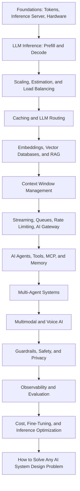

> 本页保存的是公开项目资料快照，阅读过程不需要连接 GitHub。

# AI System Design

**AI System Design - A complete guide to learn AI System Design step by step - from LLM inference, GPUs, KV Cache, and caching to RAG, Vector Databases, AI Agents, MCP, Multi-Agent Systems, Voice AI, Guardrails, Evaluation, Observability, Cost Optimization, and a step-by-step framework to crack any AI System Design interview. Everything in one place, explained in simple words, with detailed blogs for every deep dive.**

> This AI System Design guide is helpful for anyone who wants to become:
>
> - AI Engineer
> - Gen AI Engineer
> - LLM Engineer
> - Agentic AI Engineer
> - AI Agent Engineer
> - Forward Deployed Engineer
> - AI Solutions Architect
> - AI Platform Engineer
> - Applied AI Engineer
> - Machine Learning Engineer
> - MLOps Engineer
> - LLMOps Engineer
> - Backend Engineer building AI products

---

### Prepared and maintained by the **Founder** of [Outcome School](https://outcomeschool.com): Amit Shekhar

### Follow Amit Shekhar

- [X/Twitter](https://twitter.com/amitiitbhu)
- [LinkedIn](https://www.linkedin.com/in/amit-shekhar-iitbhu)
- GitHub

### Follow Outcome School

- [YouTube](https://youtube.com/@OutcomeSchool)
- [X/Twitter](https://x.com/outcome_school)
- [LinkedIn](https://www.linkedin.com/company/outcomeschool)
- GitHub

## I teach at Outcome School

- [AI and Machine Learning](https://outcomeschool.com/program/ai-and-machine-learning)

---

> **Note: AI System Design is moving very fast, so this guide will continue to grow as I write more blogs on new topics. Bookmark it and come back whenever you want a refresher. Keep learning.**

---

## Table of Contents

- About This AI System Design Guide
- What is AI System Design?
- Who is This AI System Design Guide For?
- What Will We Learn in This AI System Design Guide?
- How to Use This AI System Design Guide
- AI System Design Learning Path
- Why study AI System Design?
- How is AI System Design different from regular System Design?
- LLM Recap
- The Big Picture
- Inference Server
  - Choosing an Inference Engine
- AI Hardware: GPU, TPU, and LPU
- Tokens, Latency, and Throughput
  - Time to First Token (TTFT)
  - Tokens per Second (TPS)
  - Throughput
  - Cost per Token
- Prefill and Decode: The Two Phases of LLM Inference
  - Prefill
  - Decode
  - Chunked Prefill
  - Prefill-Decode Disaggregation
- Scaling AI Systems
  - Vertical Scaling
  - Horizontal Scaling
  - Tensor Parallelism
  - Pipeline Parallelism
  - How to choose
- Auto Scaling for AI
- Back-of-the-envelope Estimation for AI
  - Token Estimation
  - GPU Estimation
  - Cost Estimation
- Load Balancing for LLM Servers
  - Least Outstanding Tokens
  - Prefix-Aware Routing
  - Sticky Sessions
- Caching in AI
  - KV Cache
  - KV Cache Compression
  - Prompt Cache
  - Semantic Cache
  - Embedding Cache
- LLM Routing (Model Routing)
- Vector Database
  - Vector Index Types
- RAG (Retrieval Augmented Generation)
  - Document Parsing and Ingestion
  - Chunking Strategies
  - Hybrid Search
  - Query Transformation with HyDE
  - Reranking
  - ColBERT and Late Interaction
  - Agentic RAG
  - GraphRAG
  - Vectorless RAG
- Context Window Management
  - Context Rot, Lost in the Middle, and RoPE Decay
  - Context Engineering
  - Truncation
  - Summarization
  - Sliding Window
  - Compaction
  - Hierarchical Memory
- Streaming Responses
  - Server-Sent Events (SSE)
  - WebSockets
- Async Processing for Long AI Tasks
- Message Queues in AI Systems
- Rate Limiting in AI
  - Tokens Per Minute (TPM)
  - Requests Per Minute (RPM)
  - Concurrent Requests
  - Cost-Based Rate Limiting
- AI Gateway
- Embeddings Pipeline
  - Choosing an Embedding Model
  - Matryoshka Embeddings
- AI Agents and Agentic Systems
  - The Five Core Parts
  - How an AI Agent Works End to End
  - Types of AI Agents
  - Computer Use and Browser Agents
  - Common Failure Modes
  - AI Orchestration vs AI Agents
  - Loop Engineering
  - Graph Engineering
- Tool Calling
- Model Context Protocol (MCP)
  - How MCP works
  - Why MCP matters for AI System Design
  - When to use MCP
  - When MCP is overkill
- Agent Skills
- Structured Output
- Memory for AI Agents
  - The Memory Stack
  - The Four Core Operations
  - How Memory Flows at Runtime
  - What to Store and What Not to Store
- Multi-Agent Systems
  - The Three Pillars
  - Common Agent Roles
  - A Concrete Example: Customer Support
  - Coordination Patterns
  - AI SubAgents
  - Trade-offs
  - A2A (Agent2Agent Protocol)
  - How A2A works
  - How MCP and A2A fit together
- Multimodal Systems
  - Storage
  - Pre-processing Pipeline
  - Token Cost
  - Output Modalities
  - Latency
  - Voice and Realtime APIs
  - Edge AI and On-Device Inference
- Guardrails and Safety
  - Input Guardrails
  - Output Guardrails
  - Prompt Injection
  - AI Red Teaming
  - LLM Watermarking
- Data Privacy and Compliance
  - PII Redaction
  - Data Residency
  - No-Train and BAA Clauses
  - Voice and Multimodal Privacy
  - Audit Logs
- Observability in AI Systems
- Evaluation Pipeline
  - LLM as a Judge
  - Evaluating AI Agents
- Prompt Management
  - Programmatic Prompting with DSPy
- Cost Optimization
  - 1. Use a cheaper model when possible
  - 2. Use prompt caching
  - 3. Use semantic cache
  - 4. Shorter outputs
  - 5. Self-host smaller models
  - 6. Batch inference
  - 7. Better retrieval (for RAG)
- Multi-Tenancy
- Fine-Tuning Infrastructure
  - Training Cluster
  - Training Data Pipeline
  - Experiment Tracking
  - Model Registry
  - Evaluation
- Inference Optimization
  - Quantization
  - Continuous Batching
  - Speculative Decoding
  - Test-time Compute (Inference-time Scaling)
  - Flash Attention
  - Mixture of Experts (MoE)
  - Model Distillation
  - Grouped Query Attention (GQA)
- Fault Tolerance
  - Timeouts
  - Retries with Backoff
  - Fallback Models
  - Graceful Degradation
  - Output Validation
- How to Solve Any AI System Design Problem
  - Step 1: Requirements
  - Step 2: AI Objective
  - Step 3: Data Preparation
  - Step 4: Architecture Design
  - Step 5: Model Selection and Prompting
  - Step 6: Evaluation
  - Step 7: Deployment and Serving
  - Step 8: Monitoring
- Real-World AI System Case Studies
  - Case Study 1: How Claude Code Works
  - Case Study 2: How Cursor Works
  - Case Study 3: Design a Real-Time Voice AI Agent
- AI System Design Interview Questions
- Quick Summary
- AI System Design Key Concepts Glossary
- AI System Design FAQs
- License

## About This AI System Design Guide

In this guide, we will learn about AI System Design, the discipline of putting GPUs, inference servers, caches, vector databases, AI agents, gateways, guardrails, and evals together into one system that is fast, cheap, reliable, and safe. We will also see how an LLM actually runs on a GPU, how prefill and decode shape latency, how caching, routing, and batching cut the cost, how RAG and AI Agents are built for production, how we keep the system safe and measurable, and a step-by-step framework to solve any AI System Design problem in an interview or in real production.

When we use a product like ChatGPT, Cursor, Perplexity, or Claude Code, we see a simple chat box and a streamed response. Behind that simple interface, there is a lot more happening - GPUs, inference servers, vector databases, agent loops, caches, gateways, guardrails, and a long list of design decisions that all have to work together.

This guide is everything we need in one place. We start with the basics like tokens and the inference server, build up through hardware, prefill and decode, scaling, caching, RAG, agentic systems, multi-agent systems, multimodal and voice systems, safety, observability, evaluation, and inference optimization, and finish with a step-by-step framework to solve any AI System Design problem.

Every section is:

- **Written for beginners.** No jargon. No assumptions. Every term is explained before it is used.
- **Practical.** Real numbers, real trade-offs, real tools, and real architecture diagrams.
- **Connected to a deep dive.** Wherever a topic deserves more depth, we link to a detailed blog that explains it from the ground up.

This guide focuses on the System Design side of AI. To learn the complete AI Engineering path - Machine Learning, Deep Learning, Transformers, LLMs, Fine-Tuning, RAG, AI Agents, and more - check out the AI Engineering Course.

## What is AI System Design?

**AI System Design is the discipline of designing the complete system around an AI model, especially a Large Language Model (LLM), so that it can serve real users in a way that is fast, cheap, reliable, safe, and measurable.**

In simple words:

**AI System Design = System Design + The new constraints of AI models.**

The new constraints are GPUs, tokens, long and streamed responses, non-deterministic output, and a real cost on every single request. AI System Design is how we design caches, queues, databases, gateways, retrieval, agents, guardrails, and evals around these constraints.

Let's say we want to build a customer support chatbot. Calling an LLM API in a script takes ten lines of code. But serving 100,000 users with an answer that starts in under a second, stays grounded in our own documents, never leaks private data, and fits within a monthly budget - that is AI System Design.

## Who is This AI System Design Guide For?

This AI System Design guide is for:

- **Software Engineers** who want to move into AI Engineering.
- **Backend, Mobile, and Frontend Developers** who want to build AI-powered products.
- **Machine Learning Engineers and Data Scientists** who want to take models to production.
- **Engineering Managers, Tech Leads, and Architects** who want to understand how modern AI systems are built.
- **Students and freshers** who want to start a career in AI.
- **Anyone preparing for AI System Design interviews**, AI Engineer interviews, and GenAI Engineer interviews.

## What Will We Learn in This AI System Design Guide?

In this AI System Design guide, we will learn:

- **The foundations:** how AI System Design differs from regular System Design, tokens, the inference server, choosing an inference engine, and the hardware (GPU, TPU, LPU).
- **LLM inference:** prefill vs decode, TTFT, TPOT, throughput, chunked prefill, and prefill-decode disaggregation.
- **Scaling:** vertical and horizontal scaling, tensor parallelism, pipeline parallelism, auto scaling with warm pools, back-of-the-envelope estimation, and load balancing for LLM servers.
- **Caching:** KV Cache, Paged Attention, KV Cache Compression, Prompt Cache, Semantic Cache, and Embedding Cache.
- **LLM Routing:** rule-based, classifier-based, embedding-based, LLM-as-router, and cascade routing.
- **Retrieval:** embeddings, vector databases, vector indexes, RAG, document parsing, chunking, hybrid search, HyDE, reranking, ColBERT, Agentic RAG, GraphRAG, and Vectorless RAG.
- **Context:** context window management, context rot, lost in the middle, context engineering, and context compaction.
- **Serving patterns:** token streaming, async processing, message queues, rate limiting, and the AI Gateway.
- **AI Agents:** the five core parts, the agent loop, the harness, AI Orchestration vs AI Agents, Loop Engineering, Graph Engineering, ReAct, Plan-and-Execute, Reflection, and computer-use agents.
- **Tools and knowledge:** tool calling, MCP, Agent Skills, structured output, and agent memory.
- **Multi-Agent Systems:** the three pillars, agent roles, coordination patterns, SubAgents, and A2A.
- **Multimodal and Voice AI:** voice AI agents, the latency budget, barge-in, cloud vs on-device deployment, and edge AI.
- **Safety:** guardrails, prompt injection, AI red teaming, LLM watermarking, and data privacy and compliance.
- **Quality:** observability with traces and spans, LLM evaluation, LLM as a Judge, and AI Agent evaluation.
- **Operations:** prompt management, DSPy, cost optimization, multi-tenancy, fine-tuning infrastructure, and fault tolerance.
- **Inference optimization:** quantization, continuous batching, speculative decoding, test-time compute, Flash Attention, Mixture of Experts, distillation, and Grouped Query Attention.
- **Interviews:** a step-by-step framework to solve any AI System Design problem, real-world case studies, and common AI System Design interview questions.

## How to Use This AI System Design Guide

- If we are new to AI System Design, we read it from top to bottom. Each section builds on top of the previous one.
- If we are preparing for an interview, we read How to Solve Any AI System Design Problem first, and then come back to the building blocks.
- If we want to go deep into any topic, we open the linked blog. Every linked blog explains one concept from the ground up.
- After every section, we try to explain it to a friend in our own words. If we can explain it, we have learned it.

## AI System Design Learning Path



I am **Amit Shekhar**, Founder @ [Outcome School](https://outcomeschool.com), I have taught and mentored many developers, and their efforts landed them high-paying tech jobs, helped many tech companies in solving their unique problems, and created many open-source libraries being used by top companies. I am passionate about sharing knowledge through open-source, blogs, and videos.

I teach [AI and Machine Learning](https://outcomeschool.com/program/ai-and-machine-learning) at Outcome School.

Let's get started.

## Why study AI System Design?

When most of us start with AI, we just pick an OpenAI or Anthropic API key, write a small script that calls the API, and get a response back. We feel that our AI app is built.

For a small project or a personal demo, this is good enough.

But the real world is very different.

In the real world, an AI product serves millions of users. Each user sends long prompts. Each response is streamed token by token. Models are slow. GPUs are expensive. Costs add up fast. Hallucinations creep in. Latency matters.

A single API call cannot handle all of this.

To make our AI product reliable, fast, cheap, and safe, we have to think about many things together. This is where **AI System Design** comes into the picture.

## How is AI System Design different from regular System Design?

In regular [system design](https://outcomeschool.com/blog/system-design), we deal with CPU, RAM, disk, databases, and network.

In AI System Design, we deal with all of these, and on top of that, we deal with:

- **GPUs:** LLMs run on GPUs, not CPUs. GPUs are expensive and limited.
- **Tokens:** LLMs do not work with characters. They work with tokens. Both input and output are billed per token.
- **Long requests:** A single LLM call can take 30 seconds or even minutes. Regular APIs return in milliseconds.
- **Streaming:** LLM responses are [streamed token by token](https://outcomeschool.com/blog/how-does-token-streaming-work). Not a single big response.
- **Non-deterministic output:** The same input can give different outputs. We cannot just unit-test like regular code.
- **Cost per request:** Every API call costs real money. A bug in a loop can burn thousands of dollars overnight.

So all the regular system design concepts (load balancers, caches, queues, databases) still apply. But we have to use them differently because the workload is different.

## LLM Recap

Before we go into AI System Design, let's quickly recap what an LLM is.

LLM stands for **Large Language Model**. It is a model that takes some text as input and predicts the next token. It does this again and again until the full response is generated.

The text is not directly given to the model. It is first broken into smaller pieces called **tokens**. Think of it like a chocolate bar. The full bar is the sentence. Each small part we break off is a token. The model processes multiple tokens at a time. Most modern LLMs use [BPE (Byte Pair Encoding)](https://outcomeschool.com/blog/bpe-in-llms) to do this tokenization. One token is roughly 4 characters in English. So short common words like "AI" or "Hello" are one token. Longer words like "Bangalore" are 2 tokens. Compound names like "ChatGPT" are 2 to 3 tokens depending on the tokenizer.

LLMs generate text **one token at a time**. This is called [**autoregressive**](https://outcomeschool.com/blog/autoregressive-models) generation, which means the model keeps feeding its own output back as the new input. Let's say we give the model this input:

```
"I love"
```

The model looks at "I" and "love", and predicts the next token: "teaching". The full sequence becomes "I love teaching". The model now looks at "I", "love", and "teaching" and predicts the next token: "AI". The full sequence becomes "I love teaching AI". This process continues, one token at a time, until the model decides to stop.

At every step, the model does not know the next token for sure. It gives a probability to every possible token, and then one token is picked. Settings like [Temperature](https://outcomeschool.com/blog/how-does-temperature-control-llm-output) and [Top-k and Top-p Sampling](https://outcomeschool.com/blog/how-do-top-k-and-top-p-sampling-work) control how this pick happens. This is also why the same prompt can give different outputs, which is one of the biggest reasons AI System Design is different from regular System Design.

Internally, the LLM is a [Transformer](https://outcomeschool.com/blog/decoding-transformer-architecture) - a stack of attention and feed-forward layers. The single most important idea inside it is the **attention mechanism**, where each token converts itself into three vectors - **Query (Q)**, **Key (K)**, and **Value (V)** - and uses them to figure out which previous tokens matter most for predicting the next one. We have a detailed blog on the [math behind Attention - Q, K, and V](https://outcomeschool.com/blog/math-behind-attention-qkv) that goes into the math step by step.

When we use an API like OpenAI, Anthropic, or Google, we send a prompt, and we get a streamed response back, one token at a time.

Examples of LLMs: GPT-5.5, Claude Opus 4.8, Gemini 3.5, Llama 4, Mistral.

If we want to go deep into LLM internals - tokenization, positional encodings, Q/K/V matrices, attention, transformer architecture, KV Cache, Paged Attention, Mixture of Experts - the [AI and Machine Learning Program](https://outcomeschool.com/program/ai-and-machine-learning) by Outcome School covers all of these from scratch.

This is enough recap. Now, let's move to the actual System Design part.

## The Big Picture

Before we go into the details, let's understand the big picture.

An AI system is just a regular system with one new component in the middle: the LLM. Everything else (load balancer, cache, database, queue) is still there. The LLM brings new constraints (slow, expensive, non-deterministic, streaming), and we have to design the rest of the system around those constraints.

In short, **an AI system is a regular system with an LLM added in the middle, plus smarter caching, streaming, cost tracking, safety, and evals built around it.**

If we keep this in mind, every AI architecture decision becomes easy to reason about.

## Inference Server

In regular system design, a server runs our application code and returns a response.

In AI System Design, we have something called the **Inference Server**.

An inference server is a special kind of server that runs the LLM. It loads the model into the GPU memory and serves prediction requests.

Most teams do not write the inference server from scratch. They use famous open-source ones like:

- **[vLLM](https://outcomeschool.com/blog/how-does-vllm-work):** Most popular open-source inference server
- **TGI (Text Generation Inference):** Built by Hugging Face
- **[SGLang](https://outcomeschool.com/blog/how-does-sglang-work):** Very fast inference server
- **[TensorRT-LLM](https://outcomeschool.com/blog/how-does-tensorrt-llm-work):** Built by NVIDIA

When we use OpenAI or Anthropic API, we are not running the inference server. We are calling their inference server over the internet.

When we run our own LLM (like Llama or Mistral), we run vLLM or TGI on a GPU machine, and our backend calls this inference server.

So the architecture looks like below:

```
Client -> Backend Server -> Inference Server (with GPU) -> LLM
```

The inference server is the heaviest component of an AI system. It needs a GPU. GPUs are expensive. A single H100 GPU costs around $25,000 to $40,000 to buy (depending on the variant, like PCIe vs SXM, and vendor) or roughly $2 to $4 per hour to rent.

Here, the analogy is simple. A regular server is like a kitchen with a few cooks. An inference server is like a kitchen with one very expensive chef (the GPU). We do not want this chef sitting idle for even a second.

This is why in AI System Design, we put a lot of effort into:

- Making the GPU run at full capacity (so we do not waste money)
- Caching responses (so we do not call the GPU again and again)
- Routing cheap requests to cheap models

### Choosing an Inference Engine

Now, let's see which inference engine to use. There are four main inference engines we will see in production. Each one has a sweet spot.

- **[vLLM](https://outcomeschool.com/blog/how-does-vllm-work):** The most widely adopted, most community support, the broadest hardware support (NVIDIA, AMD, Intel, AWS Trainium). Famous for two big tricks - **[Paged Attention](https://outcomeschool.com/blog/paged-attention-in-llms)** (smarter GPU memory management for the KV cache) and **[continuous batching](https://outcomeschool.com/blog/continuous-batching-in-llms)** (keeping the GPU full by packing many requests together). We will explain both in detail later. Default choice for most teams. Up to 24x throughput over a naive deployment.
- **[SGLang](https://outcomeschool.com/blog/how-does-sglang-work):** A newer engine. Often higher throughput than vLLM on smaller models (7B to 8B) on H100, depending on the workload. Especially good for multi-turn conversations, structured outputs, and prefix-heavy pipelines like RAG, because it reuses the KV cache of a shared prefix across requests. The gap narrows on larger 70B+ models.
- **[TensorRT-LLM](https://outcomeschool.com/blog/how-does-tensorrt-llm-work):** NVIDIA's own engine. It prepares the model ahead of time for the exact GPU it will run on, instead of figuring things out on the fly. One of the fastest options for LLM inference on NVIDIA GPUs, but it ties us closely to the NVIDIA ecosystem. Best used when we are committed to NVIDIA infrastructure and need maximum throughput and lowest latency.
- **TGI (Text Generation Inference):** Once the default for self-hosting Hugging Face models. As of December 2025, Hugging Face moved TGI to maintenance mode and now points new deployments to vLLM or SGLang.
- **[llama.cpp](https://outcomeschool.com/blog/how-does-llama-cpp-run-llms-on-everyday-hardware):** Not a data center engine. It runs LLMs on everyday hardware like a laptop, a desktop, or a small server, by shrinking the model with [quantization](https://outcomeschool.com/blog/how-does-model-quantization-work) and sharing the work between the CPU and the GPU. It loads models stored in the [GGUF](https://outcomeschool.com/blog/how-does-gguf-work) format, which is a single self-contained file with everything needed to run the model.

Rule of thumb:

- Default to **vLLM**.
- Move to **SGLang** if our workload is multi-turn chat, structured output, or RAG (high prefix overlap across requests).
- Move to **TensorRT-LLM** only if we are NVIDIA-only and the extra speed is worth the lock-in.
- Use **llama.cpp** when we want to run the model locally, on a single machine, or on the edge.

Now, we know which inference engine to use based on our use case.

## AI Hardware: GPU, TPU, and LPU

The inference engine is the software. But the software runs on a chip, and the chip decides a lot of our speed and our cost. So, before jumping into latency, we must know the three chips that come up again and again in AI System Design.

- A **CPU** is a general worker. It can do almost anything, but it does only a few things at a time.
- A **[GPU](https://outcomeschool.com/blog/how-does-a-gpu-work-for-deep-learning)** is a huge team of workers. It was made for graphics, and later we found that it is also very good at the heavy parallel math that machine learning needs. This is why NVIDIA powers almost all of modern AI.
- A **[TPU](https://outcomeschool.com/blog/how-does-a-google-tpu-work)** (Tensor Processing Unit) is Google's own chip built for one main job: doing the math that machine learning needs, and doing it very fast. **TPU = Tensor + Processing + Unit**, where a tensor is just a grid of numbers.
- An **[LPU](https://outcomeschool.com/blog/how-does-an-lpu-work)** (Language Processing Unit) is a specialist chip, introduced by Groq, built for one single job: running a large language model that is already trained, and producing text as fast as possible.

Here, the most important lesson is this: **while an LLM writes the answer, the bottleneck is memory, not math.** To produce every single token, the chip must read the full model weights from memory. A GPU keeps the weights in HBM (High Bandwidth Memory), which sits next to the chip. An LPU keeps the weights in SRAM, inside the chip itself, so the data does not have to travel.

Let me tabulate the differences between a GPU and an LPU for your better understanding.

| Point                   | GPU                                       | LPU                                      |
| ----------------------- | ----------------------------------------- | ---------------------------------------- |
| Built for               | Any parallel math, training and inference | Running a trained language model         |
| Where the weights live  | HBM, next to the chip                     | SRAM, inside the chip                    |
| Memory speed            | Around 3 TB per second                    | Around 80 TB per second                  |
| Memory size per chip    | Tens of GB                                | Around 230 MB                            |
| Chips for a large model | A few                                     | Hundreds                                 |
| Speed for a single user | Moderate                                  | Very high                                |
| Batching                | Needed to get good total output           | Not needed to get good speed             |
| Training support        | Yes                                       | No                                       |
| Flexibility             | Very high                                 | Low, everything is planned ahead of time |

So, based on our use case:

- **Use a GPU** when we are training a model, experimenting often, running many different kinds of models, or running a large batch job where nobody is waiting for the output. This is the default for most teams.
- **Use a TPU** when we are on Google Cloud and running large training or inference jobs that fit the TPU software stack.
- **Use an LPU** when the model is fixed and already trained, and the speed of the answer is what our users actually feel. Chat, voice, agents, and reasoning models fall in this bucket.

The bigger lesson goes beyond one chip. Once a workload becomes memory bound, the win comes from moving data less, not from computing more. We will see this same idea again in prefill vs decode, KV Cache, and [Flash Attention](https://outcomeschool.com/blog/decoding-flash-attention).

## Tokens, Latency, and Throughput

In regular system design, we measure latency in milliseconds and throughput in requests per second.

In AI, we have the same metrics, but we add a few new ones because of how LLMs generate output token by token.

### Time to First Token (TTFT)

This is the time it takes from sending the prompt to receiving the very first token back.

Example: We send "Tell me a story" to ChatGPT. It takes 800 ms before the first word "Once" appears on screen. TTFT is 800 ms.

This matters a lot for user experience. If the first token shows up fast, the user feels the app is responsive even if the full answer takes 10 seconds to finish.

### Tokens per Second (TPS)

This is the speed at which the model generates tokens after the first one.

Example: After the first token shows up, the model generates 50 tokens per second. So a 500-token response takes 10 seconds to fully appear.

This depends on the model size and the GPU. Smaller models are faster. Bigger models are slower but more accurate.

The same speed is often measured the other way around, as **TPOT (Time Per Output Token)**, which is the time taken to produce each token after the first one. 50 tokens per second means a TPOT of 20 ms.

### Throughput

This is the total number of tokens the inference server can produce per second across all users.

Example: If 100 users are using the system at the same time, and each one is getting 20 tokens per second, the total throughput is 2000 tokens per second.

A good AI system has:

- Low TTFT (so the user sees the response fast)
- High TPS (so the response finishes fast)
- High Throughput (so we can serve many users at once)

These three are in tension with each other. If we batch many requests together, throughput goes up but TTFT goes up too. We will see this trade-off later in continuous batching.

### Cost per Token

Every request costs money based on the number of tokens.

Modern LLM APIs now bill on three categories of tokens:

- **Input tokens:** The text we send into the model. Cheapest to compute because they are processed in parallel.
- **Output tokens:** The text the model generates. Roughly 4x to 5x more expensive than input tokens because they are produced sequentially, one token at a time.
- **Reasoning tokens:** The hidden "thinking" tokens used by [reasoning models](https://outcomeschool.com/blog/large-reasoning-models) (like the o1 and o3 family). They never appear in the visible response, but we are billed for them. For some hard prompts, reasoning tokens can be 10x or more than the visible output.

Example: Suppose a model charges $3 per 1 million input tokens and $15 per 1 million output tokens. If a user sends 1000 input tokens and gets 500 output tokens back, the cost of that one request is:

```
(1000 / 1,000,000) * $3 + (500 / 1,000,000) * $15
= $0.003 + $0.0075
= $0.0105 (about 1 cent)
```

If we are using a reasoning model, we have to add the cost of reasoning tokens too, which can be much larger than the visible output for hard prompts.

In AI System Design, we watch cost the same way we watch latency. Every dashboard, every alert, every postmortem includes the dollar number.

In short:

- **TTFT** measures how fast the first token arrives.
- **TPS** measures how fast the rest of the tokens arrive.
- **Throughput** measures how many users we can serve at the same time.
- **Cost per token** measures how much we pay for each request.

## Prefill and Decode: The Two Phases of LLM Inference

Now, let's understand why TTFT and TPS behave so differently. The answer lies in how an LLM actually answers a request. Every request goes through two distinct phases.

- **Prefill** is the first phase. It reads and processes the whole input prompt.
- **Decode** is the second phase. It generates the output tokens one at a time.

In simple words, **prefill is the model reading our question, and decode is the model writing the answer.** We have a detailed blog on [Prefill vs Decode](https://outcomeschool.com/blog/prefill-vs-decode-llm-inference-optimization) that explains both phases step by step.

Both phases use the exact same model and the exact same weights. Only the way the two phases work is different, and that small difference changes everything.

### Prefill

**Prefill is the phase where the model reads and processes our entire input prompt in one single pass and produces the very first output token.**

Let's say a student walks into an exam hall. Before writing anything, the student silently reads the entire question paper. This reading-the-whole-paper part is prefill.

Because the whole prompt is already known up front, the model can process every input token at the same time. While reading the prompt, it also computes and stores the Key (K) and Value (V) of every input token. All of these stored Keys and Values together form the **KV Cache** (we will learn about it in detail soon). At the end of prefill, the model produces the very first output token.

**Prefill is compute-bound.** It multiplies big tables of numbers with big tables of numbers, which is exactly what GPUs are built for. The math units of the GPU stay very busy, often approaching 90 percent or more on large prompts.

Longer prompts mean longer prefill. So, **faster prefill means sooner we see the first token (lower TTFT).**

### Decode

**Decode is the phase where the model generates the output tokens one at a time, reusing the KV Cache that prefill prepared.**

Continuing our exam example, the student now starts writing the answer, word by word. This slow, word-by-word writing is decode.

In decode, only one token is processed per step. The math for one token is tiny. But to produce even that one token, the GPU must still read the entire model weights and the whole growing KV Cache from its memory. So, the GPU spends most of its time waiting for data to arrive, and its math units sit only around 20 to 40 percent busy for a single request.

**Decode is memory-bandwidth-bound.** Think of a chef who must walk into a giant pantry, grab one ingredient, walk back, chop it, and repeat, one ingredient per trip. The walking back and forth (moving data from memory) takes far longer than the chopping (the tiny math).

For a typical request, prefill finishes in a fraction of a second, but decode can run for several seconds. So, **faster decode means faster we see the rest of the answer (lower TPOT).**

Let me tabulate the differences between Prefill and Decode for your better understanding.

| Aspect          | Prefill                                                 | Decode                                                |
| --------------- | ------------------------------------------------------- | ----------------------------------------------------- |
| What it does    | Processes the whole input prompt                        | Generates output tokens one by one                    |
| Parallelism     | Parallel (all prompt tokens at once)                    | Sequential (one token at a time)                      |
| Steps           | One big step                                            | Many small steps                                      |
| Bottleneck      | Compute-bound (limited by math speed)                   | Memory-bandwidth-bound (limited by data movement)     |
| GPU utilization | High (math units busy, can approach 90 percent or more) | Low (math units mostly idle, around 20 to 40 percent) |
| KV cache action | Writes the cache                                        | Reads and extends the cache                           |
| Latency metric  | Time To First Token (TTFT)                              | Time Per Output Token (TPOT)                          |
| Cost driver     | Grows with prompt length                                | Streams full weights plus KV cache every step         |

This split explains a lot of AI System Design. It is why input tokens are cheaper than output tokens. It is why a long prompt makes the first token slow. And it is why so many optimizations focus on the decode phase.

### Chunked Prefill

But, here is the catch. When prefill and decode run on the same GPU, they fight with each other. A very long prompt's prefill runs as one giant step. While that giant step runs, it hogs the GPU and freezes the token streaming of other users who are already in their decode phase. Their answers stutter.

**Chunked prefill** splits one long prompt's prefill into several smaller chunks, and slips small decode steps in between the chunks.

```
WITHOUT chunked prefill:
  long prompt: [============= ONE BIG PREFILL =============]
  other users: tok ....... (frozen, stuttering) ....... tok

WITH chunked prefill:
  long prompt: [chunk 1][chunk 2][chunk 3][chunk 4][chunk 5]
  other users: tok   tok   tok   tok   tok   tok
                  ^ a decode step slips in between the chunks
```

Here, we can see that one giant prefill freezes the other users, while chunked prefill lets their tokens keep flowing between the chunks. It is like a chef with one stove. If a customer orders a huge banquet, cooking it all at once freezes every other table's food. Instead, the chef cooks the banquet in small batches, slipping in the quick single dishes between them.

**Note:** Chunked prefill protects ongoing answers from stalling. It does not make prefill itself faster.

### Prefill-Decode Disaggregation

At large scale, we can go one step further. So, here comes [**Prefill-Decode Disaggregation**](https://outcomeschool.com/blog/prefill-decode-disaggregation) to the rescue.

**Prefill-Decode Disaggregation = Prefill + Decode + Disaggregation**, where disaggregation simply means separating things that were joined together.

**Prefill-Decode Disaggregation is the technique of running the prefill phase and the decode phase on separate GPUs, so that they never fight for the same hardware.**

In simple words, we have one group of GPUs whose only job is to read prompts, and another group of GPUs whose only job is to write answers. There are four main parts:

- **Router:** Receives every request and decides which prefill worker and which decode worker will handle it.
- **Prefill workers:** GPUs that only do prefill. They process the prompt, produce the first token, and build the KV Cache. They are tuned for heavy compute.
- **Decode workers:** GPUs that only do decode. They receive the KV Cache and generate the answer one token at a time. They are tuned for fast memory access.
- **KV Cache transfer:** The bridge between the two. The prefill worker sends the KV Cache to the decode worker over a very fast connection like NVLink, InfiniBand, or RDMA.

The flow looks like below:

```
Request
   |
   v
[Router] --> picks a Prefill worker and a Decode worker
   |
   v
[Prefill worker] --> reads the full prompt
                 --> builds the KV Cache
                 --> produces the first token
   |
   v  (KV Cache is sent over the network)
   |
[Decode worker]  --> loads the KV Cache
                 --> writes token 2, token 3, token 4 ...
   |
   v
Answer streamed to the user
```

Let's take one request with example numbers, just for the sake of understanding. A user sends a prompt of 4000 tokens and the answer will be 200 tokens long. The prefill worker processes all 4000 tokens in, say, 400 ms and produces the first token along with a KV Cache of, say, 2 GB. The user sees the answer start, so our TTFT is around 400 ms. The 2 GB KV Cache is copied to the decode worker in 20 to 50 ms. The decode worker then produces each token in, say, 20 ms, so the 200 tokens take about 4 seconds. The prefill worker has already moved on to the next user's prompt, and the decode worker is never interrupted by a big prefill.

So, the user gets a quick start (low TTFT) and a smooth flow (low TPOT), both at the same time.

Let me tabulate the differences between co-located serving and disaggregated serving for your better understanding so that you can decide which one to use based on your use case.

| Point                        | Co-located Serving                       | Disaggregated Serving                 |
| ---------------------------- | ---------------------------------------- | ------------------------------------- |
| Where prefill and decode run | Same GPU                                 | Separate prefill and decode workers   |
| Interference between phases  | Yes, prefill stalls decode               | No                                    |
| TTFT and TPOT                | Trade-off, improving one hurts the other | Both can be tuned separately          |
| Scaling                      | Scale both phases together               | Scale each phase independently        |
| KV Cache transfer            | Not needed                               | Needed for every request              |
| Network requirement          | None                                     | Fast interconnect is a must           |
| Complexity                   | Low                                      | High                                  |
| Best for                     | Small scale, single GPU, short prompts   | Large scale, many users, long prompts |

For a small setup, chunked prefill on a single GPU is simpler and good enough. For a large setup, disaggregation is the way to go. Serving systems like SGLang support it out of the box.

## Scaling AI Systems

When traffic grows, we need to scale.

In regular system design, scaling means more CPU, more RAM, or more machines.

In AI System Design, scaling has more flavors because LLMs are huge. A model like Llama 70B does not even fit in a single GPU. We need to split the model across multiple GPUs.

Let's see the different ways to scale.

### Vertical Scaling

Use a bigger machine. In AI, this means a bigger GPU.

Example: Move from an A100 (80 GB) to an H100 (80 GB but faster) or to an H200 (141 GB).

This works only up to a point. The biggest GPU on the market is still limited. Big models do not fit.

### Horizontal Scaling

Add more GPU machines and put a load balancer in front of them.

Example: We have 4 inference servers, each running Llama 8B on a single A100. The load balancer distributes user requests across these servers.

This is the most common form of scaling. It works perfectly when the model fits in one GPU.

### Tensor Parallelism

When the model does not fit in one GPU, we split the model itself across multiple GPUs.

Example: Llama 70B in 16-bit precision needs around 140 GB. A single A100 has 80 GB. So we split the model across 2 A100s. Each GPU holds half of the model weights. When a forward pass happens, the GPUs talk to each other very fast over **NVLink** (a high-speed direct connection between NVIDIA GPUs that is much faster than going over a regular network) to compute the result.

This is called **tensor parallelism** because we split the tensors (weight matrices) of the model across GPUs.

### Pipeline Parallelism

In pipeline parallelism, we put different layers of the model on different GPUs.

Example: A model has 80 layers. We put layers 1 to 40 on GPU 1 and layers 41 to 80 on GPU 2. The token first goes through GPU 1, then to GPU 2.

This is good for very large models that have many layers.

Here is a side-by-side picture of the two parallelism styles:

```
Tensor Parallelism                         Pipeline Parallelism
(split each layer across GPUs)             (split layers across GPUs)

         Input                                    Input
           |                                        |
           v                                        v
   +--------+--------+                         +---------+
   | GPU 1  | GPU 2  |  layer 1                |  GPU 1  |   layers 1..40
   | weight | weight |  (weights split)        +---------+
   | half A | half B |                              |
   +--------+--------+                              v
           |                                   +---------+
           v                                   |  GPU 2  |   layers 41..80
   +--------+--------+                         +---------+
   | GPU 1  | GPU 2  |  layer 2                     |
   |  ...   |  ...   |                              v
   +--------+--------+                            Output
           |
           v
        Output
```

In tensor parallelism, the GPUs talk to each other inside every layer. In pipeline parallelism, each GPU finishes its layers before passing the token to the next GPU. Both can be combined for very large models.

### How to choose

We pick the scaling strategy based on our model size and traffic:

- Small model + low traffic: One GPU is enough.
- Small model + high traffic: Horizontal scaling with a load balancer.
- Big model + low traffic: Tensor parallelism within one machine (multiple GPUs).
- Big model + high traffic: Tensor parallelism for the model + horizontal scaling for the traffic.

## Auto Scaling for AI

This is similar to regular auto scaling, but with one big difference.

In regular auto scaling, we add a new EC2 instance (a virtual server on AWS) when CPU usage crosses a threshold. This takes 30 seconds to 2 minutes.

In AI, when we add a new inference server, the GPU has to load the model first. A 70B model can take anywhere from 1 to 10 minutes to load into GPU memory, depending on whether the weights live on local SSD, network storage, or remote object storage. So we cannot just spin up a new GPU when traffic suddenly spikes.

So, here comes the **warm pool** to the rescue. We keep some inference servers always warm (always running, model already loaded). When traffic spikes, we route to these warm pools first, and in the background, we spin up more machines.

So in AI, auto scaling is slower and more careful. We always keep extra capacity ready because cold starts are very expensive.

## Back-of-the-envelope Estimation for AI

In AI System Design interviews, we estimate three things:

1. Token Estimation
2. GPU Estimation
3. Storage Estimation (for vector DB, embeddings, logs)

Let's take an example. We are building a ChatGPT-like product. Suppose we have 10 million daily active users, and each user has 5 conversations per day with an average of 2000 input tokens and 500 output tokens per conversation.

### Token Estimation

```
Daily input tokens  = 10 million * 5 * 2000 = 100 billion tokens per day
Daily output tokens = 10 million * 5 * 500  = 25  billion tokens per day
Total tokens per day = 125 billion tokens
```

### GPU Estimation

Suppose one H100 GPU can produce 5000 tokens per second on a Llama-70B-class model.

```
Tokens per H100 per day = 5000 * 60 * 60 * 24 = 432 million tokens per day
Total H100 GPUs needed  = 25 billion / 432 million = ~58 GPUs (just for output)
```

For input processing, we usually need fewer GPUs because input tokens are processed in parallel (we will see this in continuous batching).

So roughly 60 to 100 H100 GPUs are needed.

### Cost Estimation

```
H100 cost per hour = $3 (rented)
Daily cost  = 60 * 24 * 3 = $4320 per day
Monthly cost = ~$130,000 per month
```

This is for the inference alone. Storage, vector DB, observability, etc. add more cost.

This kind of estimation is what we do in AI System Design interviews. The numbers here are just examples, but the method is what matters.

## Load Balancing for LLM Servers

In regular system design, we use round-robin or least-connection algorithms to distribute requests.

In AI, round-robin is a bad choice. Why?

Because LLM requests are not equal. One request can take 1 second (short answer) and another can take 60 seconds (long answer). If we use round-robin, one server can get stuck on long requests while another sits idle.

So in AI, we use smarter load balancing.

### Least Outstanding Tokens

The load balancer tracks how many tokens each server is currently generating. The next request goes to the server with the fewest outstanding tokens. This is much more accurate than counting connections.

### Prefix-Aware Routing

When two requests share a long common prefix (like a long system prompt), routing them to the same server is faster because the [KV cache](https://outcomeschool.com/blog/kv-cache-in-llms) (we will learn about this soon) for that prefix is already warm.

Example: A coding assistant has the same 5000-token system prompt for every request. If we route all requests to different servers, each server has to recompute that prefix from scratch. If we route them to the same server, the prefix is already cached.

### Sticky Sessions

For a long conversation with the same user, we sometimes want to send all requests of that user to the same server, so the conversation history stays warm in cache.

So in AI, the load balancer is much smarter than in regular system design.

## Caching in AI

Caching in AI is much richer than caching in regular systems. The basic shape of any cache is the same. On every request, we check the cache first. If the data is there (a **cache hit**), we return it without calling the LLM. If not (a **cache miss**), we call the LLM, store the result in the cache, and return the answer.

```
Cache Hit (data already cached, skip the LLM)

   Client  --->  Server  --->  Cache
                                  |
                                  | (found)
                                  v
   Client  <---  Server  <-----  Cache


Cache Miss (data not in cache, call the LLM and store)

   Client  --->  Server  --->  Cache
                                  |
                                  | (not found)
                                  v
                  Server  --->  LLM
                                  |
                                  v
                  Server  --->  Cache (store for next time)
                                  |
   Client  <---  Server  <--------+
```
