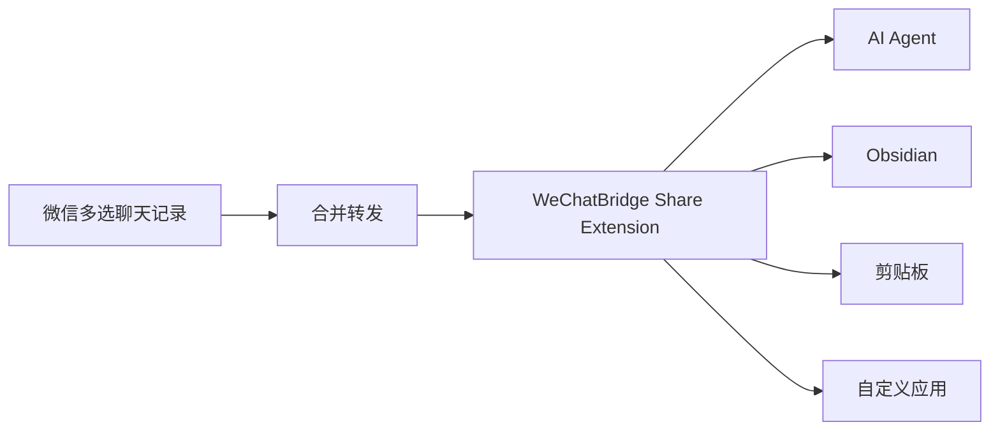

> 本页保存的是公开项目资料快照，阅读过程不需要连接 GitHub。

WeChatBridge（微信流）
  从微信转发菜单，把聊天记录送进 AI Agent 与本地知识库。
  原生、轻量、完全本地的 macOS 微信聊天记录转发与归档工具。

  
    
    
    
    
  

  简体中文 · English


> [!NOTE]
> 当前仓库已开放源代码，首个公开安装包正在准备中。现阶段可按下方步骤从源码构建体验。

## 为什么做微信流

macOS 微信 4.1.13 起，多选聊天记录后可以“合并转发”给第三方应用。微信会生成一份包含 TXT、图片和视频的 ZIP，天然适合交给 AI Agent 处理，也适合沉淀进本地知识库。

系统的“转发到其他应用”列表只展示带有 Share Extension 的 App。微信流补齐这层入口，让一次转发直接抵达 Codex、Claude、豆包、千问办公、WorkBuddy、WeSight、Obsidian、剪贴板或你指定的其他应用。



## 核心能力

| 能力 | 使用体验 |
| --- | --- |
| 九个原生入口 | 在微信转发菜单直接选择目标，无需打开微信流主窗口 |
| AI Agent 转发 | 激活目标 App，附加场景指令并自动粘贴聊天归档 |
| Obsidian 沉淀 | 生成 Markdown 笔记，保存原始 ZIP，并按聊天名组织内容 |
| 自定义目标 | 添加任意 macOS 应用，终端类应用可只接收文件路径 |
| 场景与技能 | 为不同群聊保留场景提示词，并管理兼容 Agent 的 `SKILL.md` |
| 本地记录 | 查看批次状态、重新发送、复制、定位文件和清理历史 |
| 失败兜底 | 目标未安装或权限不足时，文件仍会保留在剪贴板 |
| 双语界面 | 完整支持简体中文与 English |

### 内置转发入口

| 入口 | 行为 |
| --- | --- |
| 发给 Codex | 激活 ChatGPT/Codex 并粘贴聊天归档 |
| 发给 Claude | 激活 Claude 并粘贴聊天归档 |
| 发给豆包 | 激活豆包并粘贴聊天归档 |
| 发给千问办公 | 激活千问办公并粘贴聊天归档 |
| 发给 WorkBuddy | 激活 WorkBuddy 并粘贴聊天归档 |
| 发给 WeSight | 激活 WeSight 并粘贴聊天归档 |
| 沉淀到 Obsidian | 创建 Markdown 笔记并保存原始附件 |
| 复制到剪贴板 | 保留文件，交给用户手动粘贴 |
| 发送到自定义 | 转发到用户维护的应用列表 |

## 隐私设计

微信流的处理边界保持清晰：

- 聊天内容只来自微信主动导出的文件。
- 不读取微信数据库，不解密、不注入、不修改微信进程。
- 聊天归档、场景和记录保存在本机。
- Share Extension 在 macOS 沙盒中运行且没有网络权限。
- 屏幕录制权限只用于识别微信标题栏中的聊天名，图像仅在内存中处理。
- 辅助功能权限只用于激活目标应用和执行粘贴。
- 自动更新机制预留给 GitHub Releases，当前源码配置尚未启用自动检查。

更完整的能力边界见 产品能力文档。

## 系统要求

- macOS 14 Sonoma 或更高版本
- Xcode 16 或兼容 Swift 6 的 Command Line Tools
- 使用自动粘贴时，需要在系统设置中授予辅助功能权限
- 使用聊天名识别时，需要授予屏幕录制权限

## 从源码构建

```bash
git clone https://github.com/freestylefly/WeChatBridge.git
cd WeChatBridge
swift test
CONFIG=release Scripts/make-app.sh
```

构建产物位于 `dist/微信流.app`。安装到当前用户的“应用程序”目录并注册分享扩展：

```bash
Scripts/install-dev-build.sh
```

随后打开“微信流 → 设置 → 入口”，启用需要的分享入口。也可以前往“系统设置 → 通用 → 登录项与扩展 → 共享”管理它们。

> [!TIP]
> 本地构建会优先使用钥匙串中的 Apple Development 或 Developer ID 签名。没有可用证书时会使用 ad-hoc 签名，macOS 可能要求重新授予辅助功能权限。

## 项目结构

```text
Sources/
├── WeChatBridgeApp/      # 主应用、设置、转发编排与权限管理
├── WeChatBridgeCore/     # 批次、场景、归档和剪贴板核心逻辑
└── WeChatBridgeShare/    # macOS Share Extension
Resources/                # 图标、Plist、entitlements 与内置技能
Scripts/                  # 构建、安装、签名和发布脚本
Tests/                    # Swift Testing / XCTest 测试
site/                     # Sparkle 更新源与版本说明
```

项目使用 Swift Package Manager 管理源码和 Sparkle 依赖。`Scripts/make-app.sh` 会把主程序与九个 Share Extension 组装成完整的 `.app`。

## 开发与验证

```bash
# 运行测试
swift test

# 校验中英文资源
swift Scripts/check-localizations.swift

# 检查签名、Bundle ID、App Group 与发布配置
Scripts/check-release-config.sh

# 构建、安装并打开开发版本
Scripts/dev-preview.sh
```

## 参与贡献

欢迎提交 Issue 和 Pull Request：

1. 先查看 Issues 中是否已有相关讨论。
2. Fork 仓库并从 `main` 创建功能分支。
3. 保持改动聚焦，为行为变化补充测试。
4. 提交前运行 `swift test` 和本地化检查。
5. 在 Pull Request 中说明动机、验证方式与界面变化。

涉及安全问题时，请通过 GitHub 的 Security Advisories 私下报告，避免在公开 Issue 中附上敏感细节。

## 路线图

- [x] 微信原生合并转发接入
- [x] Codex、Claude、豆包、千问办公、WorkBuddy 与 WeSight
- [x] Obsidian 本地归档
- [x] 场景提示词与技能管理
- [x] Universal 2 构建、签名与公证流程
- [ ] 首个公开 DMG Release
- [ ] Homebrew Cask
- [ ] 更多社区场景和技能包

## 许可证

WeChatBridge 使用 MIT License 发布。

## 致谢

- Sparkle 提供安全的 macOS 应用更新能力。
- 感谢所有参与测试、提出建议和贡献代码的朋友。


  如果微信流对你有帮助，欢迎点亮 ⭐️，让更多需要本地工作流的人看到它。
