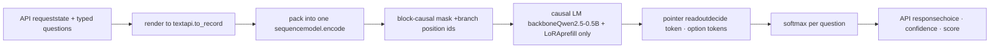
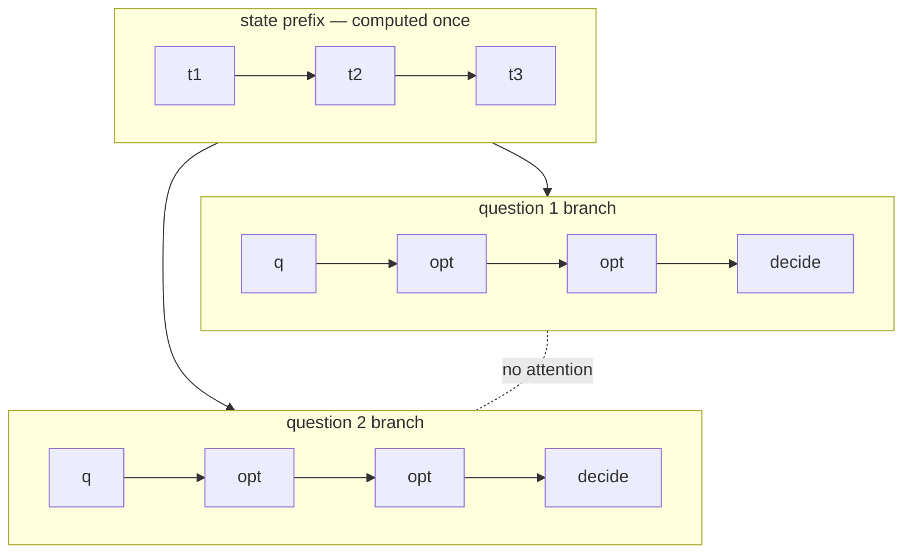

> 本页保存的是公开项目资料快照，阅读过程不需要连接 GitHub。

# kev

Jev-inspired decision model. Typed questions in, calibrated probabilities out, one forward pass.


  
  
  
  


*图片：kev playground*

kev is a LoRA adapter and a small readout head on top of Qwen2.5-0.5B. It reads a document once and answers many typed questions about it in parallel, in a single prefill pass with no decoding. The document and every question are packed into one sequence; a block-causal mask lets each question see the document but never another question. A pointer head then scores each question's options against its decision token and applies softmax. Those probabilities are the output. The head is trained with cross-entropy against labelled outcomes, so the probabilities are learned rather than generated as text.

The architecture follows the reconstruction of TypeSafe's Jev in [Jev's Architecture Unmasked](https://archerhume.com/posts/jevs-architecture-unmasked). The API follows TypeSafe's [System One](https://docs.typesafe.ai/api) contract, so the official `typesafe-sdk` works against a local kev server with a `base_url` change.

## Highlights

- **Three question types.** `noul` (yes/no), `choice` (2–255 options), `score` (ordered levels). One shared readout.
- **One pass, many answers.** The state is encoded once. Questions run as isolated branches under a block-causal mask.
- **Isolation is exact.** A question cannot see a sibling question. Packed and separate requests agree to `4e-6`.
- **Probabilities, not prose.** Trained with cross-entropy. Held-out ECE 0.065, 0.031 after one-parameter temperature scaling.
- **Drop-in API.** `POST /v1/systemone` with TypeSafe's request and response shapes. Their SDK's quickstart runs unmodified.
- **Runs on a laptop.** `kev-0.5b` trains in about 1h45m on an Apple M5 and serves a six-question request in ~160 ms.

*图片：training*

## Installation

Requires Python 3.12+, [uv](https://docs.astral.sh/uv/), and Node 20+ for the playground. Tested on Apple Silicon (MPS). CUDA is untested.

```bash
git clone https://github.com/jaredpalmer/kev.git && cd kev
uv sync --extra serve
cd playground && npm install && cd ..
```

### Download the weights

The trained adapter is on the Hugging Face Hub as [`jaredpalmer/kev-0.5b`](https://huggingface.co/jaredpalmer/kev-0.5b) (base Qwen2.5-0.5B, tag `v0.1`; the checkpoint in this README). `--run` accepts a Hub id directly; the base model downloads on first load.

```bash
uv run --extra serve python -m kev.serve --run jaredpalmer/kev-0.5b --port 8009
```

The same files are attached to the GitHub release as `kev-0.5b.tar.gz`.

## Quick Start

Start the server:

```bash
uv run --extra serve python -m kev.serve --run runs/kev --port 8009
```

Ask it something:

```bash
curl -s localhost:8009/v1/systemone -H 'content-type: application/json' -d '{
  "state": "Shoes arrived two weeks late and in the wrong size. Also I see two charges on my card.",
  "model": "kev-latest",
  "questions": {
    "department":  {"type": "choice", "instructions": "Which team should handle this?",
                    "criteria": {"returns": "Exchanges, refunds, wrong or damaged items",
                                 "shipping": "Delivery status, delays, lost packages",
                                 "billing": "Charges, invoices, payment problems"}},
    "escalate":    {"type": "noul",  "instructions": "Does this need urgent human attention?"},
    "frustration": {"type": "score", "instructions": "How frustrated is the customer?",
                    "criteria": ["Calm", "Frustrated", "Very angry"]}
  }}'
```

```json
{
  "model": "kev-latest",
  "answers": {
    "department":  { "type": "choice", "choice": "returns", "confidence": 0.92,
                     "probabilities": { "returns": 0.94, "shipping": 0.04, "billing": 0.02 } },
    "escalate":    { "type": "noul", "noul": 0.47 },
    "frustration": { "type": "score", "score": 0.67, "confidence": 0.74,
                     "legend": { "0": "Calm", "1": "Frustrated", "2": "Very angry" },
                     "probabilities": { "0": 0.43, "1": 0.47, "2": 0.10 } }
  },
  "usage": { "input_tokens": 253, "output_tokens": 156 },
  "latency_ms": 162
}
```

Or use the TypeSafe SDK:

```python
from typesafe_sdk import TypeSafeClient, Choice, Noul, Score

client = TypeSafeClient(api_key="local", base_url="http://127.0.0.1:8009", model="kev-latest")
r = client.system_one(
    state="I was charged twice. Please fix this ASAP.",
    questions={
        "billing": Noul(instructions="Is this ticket about billing?"),
        "tone": Choice(instructions="What is the customer's tone?", criteria={"calm": None, "frustrated": None, "angry": None}),
        "urgency": Score(instructions="How urgent is this ticket?", criteria=["can wait", "this week", "today"]),
    },
)
r.nouls["billing"].noul, r.choices["tone"].choice, r.scores["urgency"].score
```

### Playground

```bash
cd playground && npm run dev -- -p 3001
```

Open localhost:3001. Load a preset, edit the state and questions, press `⌘↵`. **Packed vs separate** compares one N-question request with N single-question requests. **Permute** re-asks a Choice under six option orders. The **Isolation probe** and **Boundary forgery** presets reproduce the two experiments from the blog post.

**Chess** at localhost:3001/chess: the legal moves are the options of one Choice question, the board is the state, and a Score rates the position in the same request. Play the model or watch it play itself; games are kept in `localStorage`.

## API

### `POST /v1/systemone`

```jsonc
{
  "state": "…",                          // string | object | array — the content to evaluate
  "model": "kev-latest",
  "questions": {
    "": {                            // you choose the id; the model never sees it
      "type": "noul" | "choice" | "score",
      "instructions": "…",               // string | object | array
      "criteria": …                      // noul: {true?, false?}  choice: {option: description|null}  score: [level, …]
    }
  }
}
```

| Answer type | Fields | Derived from the distribution `p` |
|---|---|---|
| `noul` | `noul` | `p[yes]` |
| `choice` | `choice`, `probabilities`, `confidence` | `argmax`, `p` by option key, `(p_max − 1/K) / (1 − 1/K)` |
| `score` | `score`, `legend`, `probabilities`, `confidence` | `Σ k·p[k]`, level index → text, `p` by level index |

Structured `instructions`, `criteria` and `state` are flattened to labelled text. Option and branch delimiters cannot be forged from user text. Validation errors return `422`.

### Other endpoints

| Method | Path | Purpose |
|---|---|---|
| `GET` | `/v1/models` | Model, base and run info |
| `POST` | `/v1/systemone/permute` | One Choice question under N option orders |
| `POST` | `/v1/systemone/separate` | Each question in its own pass, for comparison |

There is no authentication. The server is intended for local use.

## How It Works



**Packing.** The state and every question go into one token sequence. Reserved tokens mark the structure.

```
 …state…
 instructions  option 1   option 2  …     ← question 1
 instructions  option 1   option 2  …     ← question 2
```

**Mask.** Position `i` attends to `j` when `j ≤ i` and `j` is in the state or in the same question as `i`. State tokens are computed once. Question branches never see each other.



**Positions.** Each branch restarts its position ids after the state. Every question sees "state, then one question". Question order does not matter.

**Readout.** A pointer head scores each option's `` hidden state against the `` hidden state and applies softmax. `K` is whatever the request sends. `` follows all options, so the model reads the full list before scoring; this is what makes "none of the above" work.

**Training.** LoRA (r=16) on the backbone, head from scratch, cross-entropy on the option distribution. Training data and live requests go through the same renderer, so the model never meets a format at inference that it did not see in training.

## Training

`kev-0.5b` is trained on six public datasets converted to TypeSafe-shaped requests: Banking77 (77-way Choice), AG News (Choice + yes/no), MNLI (3-way Choice), BoolQ (Noul), SST-5 and Yelp (5-level Score). 9,000 records, 13,500 questions, two epochs.

```bash
# sanity run, ~1 minute
uv run python -m kev.train --n_per_source 40 --accum 4 --out runs/smoke

# kev-0.5b, ~1h45m on an M5
uv run python -m kev.train --n_per_source 1500 --epochs 2 --perm_kl 0 --ord_w 0 --out runs/kev
```

| Flag | Default | Purpose |
|---|---|---|
| `--base` | `Qwen/Qwen2.5-0.5B` | Causal LM backbone |
| `--n_per_source` | `1000` | Records sampled per dataset |
| `--holdout` | – | Sources to exclude, e.g. `mnli,sst5`, for out-of-source evaluation |
| `--perm_kl` | `0` | Optional symmetric KL between predictions under two option orders |
| `--ord_w` | `0` | Optional ranked probability score for ordered levels |
| `--suite` | – | Train on a frozen suite's training partition |
| `--batch`, `--dtype` | `1`, `fp32` | Padded batch size; `bf16` autocast on CUDA (fp32 master weights) |
| `--device` | auto | `cuda`, `mps`, or `cpu` |

The released `kev-0.5b` used cross-entropy without either extra loss. The current data conversion and sampling have changed, so rerunning this command does not reproduce its weights exactly. The optional ordinal loss now compares cumulative probabilities, a proper scoring rule, rather than absolute error of the expected level. Full historical recipe in the model card.

On a Mac, run one training job at a time; two jobs on the same Apple GPU slow each other by about 10×. The MBP path is kept working, but anything longer than a smoke run goes to Modal.

### Modal

Studies run as one H100 container per trial, in parallel, with results pulled back into `runs/` and ranked by the same code that runs locally.

```bash
uv run modal token new                                    # once; opens the browser
KEV_GPU=T4 uv run modal run modal_app.py::smoke           # end-to-end check, ~1 minute of GPU

uv run modal run modal_app.py::study \
    --suite evals/decision-v2 --plan experiments/data-ablation-v2.json \
    --name ablation-v2 --transfer evals/transfer-v2 \
    --existing jaredpalmer/kev-0.5b                       # legacy checkpoints scored alongside

uv run modal run modal_app.py::evaluate --run jaredpalmer/kev-0.5b --suite evals/transfer-v2 --name transfer-kev
```

A plan is a JSON list of 1–8 trials over an allowlisted set of training parameters (`kev/experiment.py`). Each trial records the local git commit, the suite hash, and the hashes of the shipped `kev/*.py`; the container refuses to run if they differ from what the launcher hashed. Training uses TF32 and optional bf16; evaluation is fp32-exact (TF32 alone moves probabilities by ~1e-3, enough to trip the isolation gate). Measured: 0.019 s/record for Qwen2.5-0.5B at batch 8 on an H100 vs 0.34 s/record on an M5, ~$0.15–0.30 per 0.5B trial.

## Evaluation

```bash
uv run python -m kev.evaluate --run runs/kev --n_per_source 150 \
    --baseline --baseline_instruct Qwen/Qwen2.5-0.5B-Instruct
```

Writes `runs/kev/eval.json`. Baselines use the same rendered text and read next-token logits over option letters.

| | Zero-shot base | Zero-shot Instruct | **kev-0.5b** |
|---|---|---|---|
| Choice, 4-way (AG News) | 0.813 / 0.069 | 0.787 / 0.160 | **0.940 / 0.028** |
| Choice, 3-way (MNLI) | 0.460 / 0.225 | 0.433 / 0.390 | **0.747 / 0.100** |
| Choice, 77-way (Banking77) | – | – | **0.860 / 0.057** |
| Noul (BoolQ) | 0.427 / 0.274 | 0.607 / 0.084 | **0.753 / 0.136** |
| Score, 5 levels (Yelp) | 0.313 / 0.043 | 0.353 / 0.078 | **0.553 / 0.118** |
| **All** (1,350 held-out questions) | | | **0.799 / 0.065** |

Cells are accuracy / ECE (10 bins). These are in-distribution numbers; the test splits come from the training datasets.

### Frozen research suite

`evals/decision-v1` is a frozen, checksummed suite: separate training, calibration, development, and locked test partitions; pinned dataset and base-model revisions; and per-record provenance. Development runs are used for model selection. The locked test is only for promoted candidates and requires `--allow-test`.

```bash
uv run python -m kev.benchmark --run runs/kev --suite evals/decision-v1 --out runs/research-kev-v01
uv run python -m kev.experiment --suite evals/decision-v1 --plan experiments/mbp-comparison.json --out runs/mbp-comparison-v1
```

Trials are configuration-only: `kev.experiment` refuses configs outside a bounded allowlist, records code, suite, and git hashes, checks complete coverage, isolation, and packing, and never reads the locked test.

### Comparison with Jev

`kev.jev` scores the same frozen development suite against the real `typesafe-ai/jev` through Vercel AI Gateway (AI SDK 7 `experimental_evaluate`, cost-capped). Jev is the hosted reference product; kev was fine-tuned on these six datasets, so this is a shared-task baseline, not a controlled ablation. On 720 clean development questions the released `kev-0.5b` had 79.7% micro accuracy and Jev 81.1%; the record-clustered macro accuracy difference was −1.8 points with 95% CI [−5.5, +1.7]. Jev rounds some probabilities to zero, so log-loss depends on the clipping floor. Results and caveats: `runs/kev-vs-jev-v1.json`; regenerate the figure with `uv run python scripts/plot_eval_comparison.py`.

*图片：kev vs Jev, preliminary per-task accuracy on the frozen development suite*

**Outside kev's training data** (`evals/transfer-v1`: TREC, DBpedia-14, Emotion, IMDB, Amazon, QNLI, TweetEval offensive, MMLU; zero exact-match overlap with any kev training state): kev-0.5b 63.3% vs Jev 82.3% on 640 clean questions, macro difference **−19.1 pp, 95% CI [−23.1, −15.0]**. kev is the better-calibrated of the two out of domain (ECE 0.052 vs 0.075) and Jev's option-order flip rate is 0.000 (kev 0.208). The in-distribution parity above does not transfer. Details: `runs/kev-vs-jev-transfer-v1.json`; plan for closing the gap: PLAN.md.

| Mechanism test | Result |
|---|---|
| Isolation — secret in sibling question / absent / in state | `p = 0.03` / `0.03` / **`0.99`** |
| Packed vs separate — max probability difference | **`3.7e-6`**, packed 2.0× faster |
| Permutation — argmax flips under 4 option orders | 7.4% |
| IIA — log-odds shift from one irrelevant option | 0.13 mean, 0.34 p90 |
| Boundary forgery — fake delimiters in option text | option count unchanged, forged option `p ≤ 0.09` |

## Limitations

- **Knowledge.** The backbone is 0.5B parameters. On the TypeSafe docs' structured-criteria example kev picks `return_policy` where Jev picks `return_status`.
- **Breadth.** Six datasets, about ten instruction templates. Tasks far from passage classification are untrained.
- **Calibration is in-distribution.** ECE on the training datasets says nothing about a new workflow. Real calibration needs outcome-labelled data from that workflow.
- **Context.** Trained at 384 state / 1,024 branch tokens; serving caps at 8,192. Jev allows ~32k per branch.
- **Serving.** fp32 on MPS, one request at a time, no cross-request KV cache, dense per-sample mask.
- **Score confidence** uses a stand-in formula. TypeSafe has not published theirs.

## Development

```bash
uv run python -m pytest tests/test_unit.py -q                                      # no weights, no server; runs in CI
KEV_BASE_URL=http://127.0.0.1:8009 uv run --extra serve python -m pytest tests/test_api.py -q   # against a running server
cd playground && npm run lint && npx tsc --noEmit -p .
```

`tests/test_api.py` runs the TypeSafe docs' example requests and the official SDK against the local server.


Troubleshooting

- **`MPS backend out of memory` while training.** Do not enable `output_hidden_states`; read `last_hidden_state` from the bare backbone. Do not add tokens with peft `trainable_token_indices`. Lower `--n_per_source` on small machines.
- **Playground shows `connecting…` and buttons do nothing.** Next.js 16 dev only trusts the hostname it started with. Use `localhost:3001` or add your host to `allowedDevOrigins` in `next.config.ts`. Nothing is logged; verify hydration with a browser, not `curl`.
- **`Dataset scripts are no longer supported`.** Use `legacy-datasets/banking77`; already wired in `data.py`.


## Authors

- Jared Palmer (@jaredpalmer)

Built with [Devin](https://devin.ai). Architecture claims from [Archer Hume](https://archerhume.com/posts/jevs-architecture-unmasked). API contract from [TypeSafe](https://docs.typesafe.ai/api). Backbone: [Qwen2.5-0.5B](https://huggingface.co/Qwen/Qwen2.5-0.5B). Related work: [Hydragen](https://arxiv.org/abs/2402.05099), [DeFT](https://arxiv.org/abs/2404.00242), [FIRST](https://arxiv.org/abs/2406.15657).

## License

Apache-2.0. The base model is distributed under the Qwen license. Datasets carry their own licenses; see the model card.
