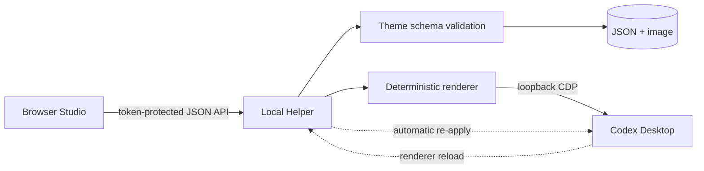
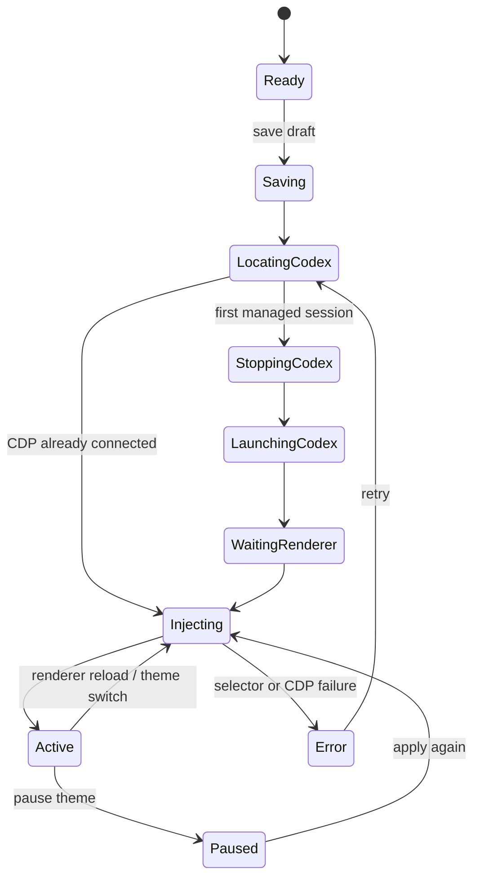

> 本页保存的是公开项目资料快照，阅读过程不需要连接 GitHub。

# Codex Theme Studio — Codex Desktop 可视化主题编辑器

简体中文 · English

> 一个面向 macOS Codex Desktop 的本地优先主题 Studio：在浏览器里设计，在本机保存，通过受限 CDP 会话热应用到 Codex。

Codex Theme Studio 同时也是一个 Codex Desktop 主题管理器、Codex 换肤工具和本地主题编辑器，支持可视化预览、模块拖拽、深浅配色、背景图片、热更新与一键恢复原生界面。

*图片：Codex Theme Studio 原神八重神子主题实机工作台*

公开预览版：`0.0.1` · 平台：macOS · 运行时：Node.js 22+

本项目是独立、从零实现的工具，不包含或搬运第三方主题项目的代码与素材。它不修改 `app.asar`、不替换 Codex 安装资源，也不是 OpenAI 官方产品。

## 实机主题预览

以下截图均来自当前项目实际运行的 Studio，展示真实主题库、实时预览和参数检查器。预览区域只使用项目内置示例文案，不包含用户的 Codex 对话、任务或工作区数据。


  
  Codex 2007 · 原生经典蓝


  
    
      
      Rick &amp; Morty · 跨维实验室
    
    
      
      水墨江湖 · Ink Jianghu
    
  
  
    
      
      赛博长安 · Cyber Chang'an
    
    
      
      深渊坠落 · Abyssal Fall
    
  


## 目录

- 实机主题预览
- 为什么这样实现
- 主要能力
- 模块化 Studio
- 架构与工作原理
- 快速开始
- 首次应用与热更新
- 主题格式
- 数据与隐私
- 安全模型
- 开发与测试
- 故障排查
- 兼容性与当前边界
- 后续安排

## 为什么这样实现

直接改 Codex 安装包虽然看起来简单，但应用升级、签名校验和回滚都会变得脆弱。本项目选择另一条路线：

1. Web Studio 只编辑经过约束的主题数据，不接触 Codex 文件。
2. 本地 Helper 负责主题存储、进程状态和受限样式生成。
3. Codex 只在运行时接收确定性的 CSS 和少量首页文字/显隐配置。
4. 暂停主题或普通方式重启 Codex 后，可以回到原生外观。

结果是：主题可以快速热切换，Codex 应用包保持原样，失败也有明确的回退路径。

## 主要能力

| 能力 | 当前行为 |
| --- | --- |
| 主题库 | 内置主题只读；用户主题可搜索，并在 hover / 键盘聚焦时就地删除 |
| 深浅主题 | Codex 主题可独立使用深色或浅色；Studio 跟随 macOS 系统外观 |
| 背景主视觉 | 支持 PNG、JPEG、WebP（最大 8 MB），背景焦点与 `cover` / `contain` |
| 自动取色 | 从图片提取强调色、辅助色、界面底色和文字色 |
| 材质 | 控制透明度、背景模糊、圆角与背景压暗 |
| 首页文案 | 自定义眉题、标题、说明和四张快捷卡片文字 |
| 首页模块 | 图标、文案、快捷卡片可独立选中、拖拽、重置和显隐 |
| 侧边栏 | 自定义左上角 `Codex` 字符；六个固定入口可独立显示/隐藏 |
| 表面对比度 | 消息、输入框、对话框、菜单、下拉框和操作图标适配主题颜色 |
| 热应用 | 已连接 CDP 时切换主题不重启；renderer 重载后自动恢复 |
| 可逆性 | “暂停主题”只移除本工具注入，Codex 安装包不会被修改 |

## 模块化 Studio

Studio 预览会自动铺满中央编辑区，不再使用固定画幅或保留无效留白。内部侧边栏、欢迎区、快捷卡片和输入框以实测的 Codex `1512 × 944` 窗口为比例基线，再通过容器单位随 Studio 尺寸响应式缩放。

*图片：Studio 模块编辑概念图*

编辑方式：

1. 在顶部选择“侧边栏 / 图标 / 文案 / 卡片 / 输入框”，或直接点击画布元素。
2. 拖拽图标、文案或卡片；位置保存为相对主内容区的百分比偏移。
3. 双击 `Codex`、眉题、标题、说明或卡片文字，直接在画布中编辑。
4. 在右侧检查器控制对齐、显隐、颜色、材质和背景。
5. 切换到“预览”后，选择框、模块标签和 hover 编辑提示会全部隐藏。
6. “重置模块”只归零当前模块，不影响其他模块。

固定模块目前包括侧边栏和输入框：可以选中并编辑相关参数，但不允许任意拖动，以避免破坏 Codex 的核心布局安全区。

## 架构与工作原理

*图片：Codex Theme Manager 架构概念图*



### 分层职责

- Browser Studio：预览、直接编辑、图片解码/取色、表单交互；没有任意文件和进程权限。
- Local HTTP Server：只监听 `127.0.0.1`，验证令牌、Host、Origin 与 Fetch Metadata。
- ThemeStore：校验主题、限制图片类型与大小、临时目录写入后原子 rename。
- ThemeSupervisor：判断是否已有 CDP 会话、组织一次性重启、应用/暂停和自动恢复。
- Deterministic Renderer：只从白名单 token 生成 CSS 与固定 DOM 操作，不接受任意 CSS、JS 或 selector。

### 应用状态



## 快速开始

### 环境要求

- macOS
- Codex Desktop 已安装
- Node.js `22` 或更新版本
- 浏览器（工具默认使用系统方式打开本地工作台）

### 启动

```bash
git clone https://github.com/JasonSTong/codex-theme-studio.git
cd codex-theme-studio
npm start
```

项目当前没有运行时第三方依赖；如后续 `package.json` 增加依赖，再执行 `npm install`。

启动成功后会输出并打开类似地址：

```text
http://127.0.0.1:54321/?token=<每次启动随机生成>
```

不要收藏或分享这个完整地址。令牌只对本次 Helper 进程有效。

开发时不自动打开浏览器：

```bash
npm run start:no-open
```

查看本机运行状态：

```bash
node src/cli.mjs status
```

## 首次应用与热更新

### 第一次应用

若 Codex 只是普通启动、还没有本工具管理的 CDP 会话：

1. Studio 先保存主题。
2. 对话框说明需要一次正常重启；用户确认后才继续。
3. Helper 请求 Codex 正常退出，不使用 `SIGKILL`。
4. Helper 以随机 CDP 端口重新打开 Codex，且只接受回环地址 target。
5. 找到主 renderer 后应用主题。

重启前请保存正在输入但尚未发送的内容。

### 同一会话中的后续切换

CDP 已连接时：

- 应用主题会直接热替换，不再重启 Codex。
- 修改文案、模块位置、显隐和颜色后可继续“保存并应用”。
- renderer 因导航或重载而重建时，Helper 会检测并恢复当前主题。

### 普通退出之后

如果完全退出 Codex，再按普通方式打开，原来的 CDP 会话不存在。下次应用主题时仍需要重新建立一次受管理会话。Helper 不安装守护进程或登录启动项。

## 主题格式

每个主题是一份严格校验的 `theme.json`，可选配一张本地图片：

```json
{
  "schemaVersion": 1,
  "id": "quiet-orbit-ab12cd34",
  "name": "Quiet Orbit",
  "palette": {
    "accent": "#73DACA",
    "secondary": "#8AA7FF",
    "surface": "#12151A",
    "text": "#EEF2F5"
  },
  "material": {
    "glassOpacity": 0.82,
    "blur": 20,
    "radius": 16,
    "backdropDim": 0.28
  },
  "composition": {
    "positionX": 50,
    "positionY": 50,
    "scale": "cover"
  },
  "copy": {
    "kicker": "CODING WITH CONTEXT",
    "headline": "今天想构建什么？",
    "subtitle": "主题定义保持简单，体验保持完整。"
  },
  "welcome": {
    "placement": "native",
    "positionX": 50,
    "positionY": 22,
    "alignment": "center",
    "visibility": {
      "icon": true,
      "copy": true,
      "cards": [true, true, true, true]
    },
    "modules": {
      "icon": { "offsetX": 0, "offsetY": 0 },
      "copy": { "offsetX": 0, "offsetY": 0 },
      "cards": { "offsetX": 0, "offsetY": 0 }
    },
    "cardLabels": ["探索并理解代码", "构建新功能、应用或工具", "审查代码并提出修改建议", "修复问题和失败"]
  },
  "sidebar": {
    "brand": "Codex",
    "visibility": {
      "newTask": true,
      "scheduled": true,
      "plugins": true,
      "sites": true,
      "pullRequests": true,
      "chat": true
    }
  },
  "hero": "hero.webp"
}
```

关键约束：

- `offsetX / offsetY` 的范围是 `-100` 到 `100`，以 Codex 主内容区宽高为基准。
- `cardLabels` 必须恰好包含四段文字；省略或设为 `null` 时保留 Codex 原生卡片文案。
- `sidebar.brand` 最多 24 个字符。
- 颜色只能使用六位十六进制格式。
- 主题不能包含任意 CSS、JavaScript、shell、文件路径或 selector。
- `placement / positionX / positionY` 仅为旧主题兼容字段；当前 Studio 使用 `welcome.modules` 独立定位。

完整说明见 架构设计。

## 数据与隐私

默认数据目录：

```text
~/Library/Application Support/CodexThemeStudio/
├── themes/
│   └── /
│       ├── theme.json
│       └── hero.png | hero.jpg | hero.webp
├── state.json
└── runtime.json
```

- 主题图片和配置只保存在本机。
- Studio 不使用远程 CDN、字体、分析服务或云同步。
- 主题数据不写进 Codex renderer 的 `localStorage`。
- 删除用户主题只删除对应主题目录，不触碰 Codex 对话、仓库或工作区。

如需完整备份，退出 Helper 后复制整个 `CodexThemeStudio` 目录即可。正式的导入/导出包计划在 0.1.0 实现。

## 安全模型

主要控制措施：

- HTTP 服务只绑定 IPv4 回环地址 `127.0.0.1`，Web 与 CDP 端口均动态选择。
- 每次启动生成 256 位 URL-safe 令牌，API 必须使用自定义请求头。
- 严格校验 Host、Origin、`Sec-Fetch-Site`、JSON body 大小和图片签名。
- Content Security Policy 禁止加载远程脚本、样式、字体和图片。
- Helper 只接受 `app://` 且 WebSocket 地址为 `ws://127.0.0.1` 的 Codex 页面 target。
- 没有通用 `evaluate` API；应用和移除表达式由本项目内部固定生成。
- 主题目录采用白名单 ID、真实路径校验和原子写入。

剩余风险：CDP 对同一台机器、同一用户权限下的其他进程没有应用级鉴权。随机端口和回环绑定降低暴露面，但不能完全消除该风险。因此本项目默认不常驻，只在需要主题时运行。

完整威胁模型见 安全模型。

## 开发与测试

```bash
npm run check   # JavaScript 语法检查
npm test        # Node.js 测试
npm run verify  # check + test
```

测试当前覆盖：

- localhost Host / Origin / Fetch Metadata / token 授权；
- 主题应用、暂停与运行时状态；
- 主题 CSS 和封闭表达式生成；
- Schema 默认值、模块偏移、卡片文字和恶意字段拒绝；
- 主题原子创建、列表、删除、图片签名与路径保护；
- CDP target 只接受回环地址上的主 `app://` 页面。

项目结构：

```text
src/
├── web/                    # Studio HTML / CSS / browser logic
├── codex/
│   ├── app-controller.mjs  # Codex lifecycle
│   ├── cdp.mjs             # target discovery and evaluate
│   ├── supervisor.mjs      # apply / pause / heal state machine
│   └── theme-renderer.mjs  # deterministic CSS + fixed DOM operations
├── server.mjs              # token-protected localhost server
├── theme-schema.mjs        # whitelist and validation
└── theme-store.mjs         # atomic local storage
themes/                     # bundled read-only themes
test/                       # Node test suite
docs/                       # architecture, security, roadmap, images
```

提交改动前至少执行 `npm run verify`。涉及 Studio UI 时，还应实测深色/浅色主题、编辑/预览模式、1440×900 附近桌面窗口和窄屏降级。

## 故障排查

| 现象 | 原因与处理 |
| --- | --- |
| 页面显示“缺少本地访问令牌” | 不要直接打开根地址；回到终端，使用本次 `npm start` 输出的完整 URL |
| “Codex 正在运行 · 尚未连接” | 属于普通启动状态；第一次应用会说明并请求一次正常重启 |
| 应用后没有变化 | 确认 Helper 仍在运行；查看底栏是否为“主题已启用”，然后重新应用 |
| 切换主题仍显示旧卡片文字 | 当前版本会优先通过 `aria-labelledby` 定位原生标签；暂停后重应用可恢复原文再切换 |
| 首页比例不对 | 先点选模块并“重置模块”；当前版本会忽略旧版整组欢迎区位移，使用独立模块偏移 |
| 模块拖动后偏离可视区 | 使用右侧“重置模块”；后续版本会增加更严格的安全区和吸附线 |
| Codex 升级后局部失效 | 背景和核心 token 通常仍有效；DOM 相关增强会降级，需要更新兼容 selector |
| 想完全恢复原生外观 | 点击“暂停主题”，或退出 Helper 后普通方式重启 Codex |
| 端口被占用 | Web 和 CDP 端口默认随机选择；若仍失败，结束旧 Helper 后重新启动 |

## 兼容性与当前边界

- 当前只实现 macOS Codex Desktop。
- Studio 预览是经过真实尺寸校准的高保真模型，不是 Codex React 组件的镜像；字体渲染和未来 DOM 版本可能存在细微差异。
- Codex 内部 DOM 不是稳定公共 API，首页、侧栏和消息表面增强可能在升级后降级。
- Helper 运行期间会自动补注入；退出 Helper 后不会常驻恢复。
- 当前不提供登录启动、菜单栏应用、签名安装包或自动更新。
- 当前没有通用的主题 zip 导入/导出，也没有跨设备同步。
- 图片仅支持单张主视觉，不包含视频、动态壁纸或远程 URL。

## 后续安排

路线图会优先保证“可逆、可诊断、升级后可降级”，再扩大外观自由度。

### 0.0.1 — 首个公开预览版（当前）

- [x] 自动铺满 Studio、以 1512×944 实测窗口为内部比例基线的响应式预览
- [x] 图标 / 文案 / 卡片独立选中与拖拽
- [x] 侧边栏品牌、首页文字和卡片文字直接编辑
- [x] 模块显隐、重置、编辑/干净预览
- [x] 深浅主题表面与对话框对比度
- [x] 中英文 README、产品截图和概念图

### 0.1.0 — 主题资产与编辑体验

- [ ] 主题导入/导出包（manifest、图片、校验和）
- [ ] 撤销/重做与未保存修改历史
- [ ] 模块吸附线、安全区、键盘微调和精确坐标输入
- [ ] 卡片图标与顺序的受限配置
- [ ] 主题复制、重命名和批量清理
- [ ] Studio 截图导出和主题预览缩略图缓存

### 0.2.0 — 兼容性与诊断

- [ ] Codex 版本识别与兼容性矩阵
- [ ] selector 健康报告和降级项可视化
- [ ] 结构化本地日志与一键脱敏诊断包
- [ ] renderer target 去重与更细粒度的更新策略
- [ ] CSS token 覆盖审计和无障碍对比度提示

### 0.3.0 — 主题生态

- [ ] 主题格式版本迁移与兼容声明
- [ ] 可选的本地主题包签名
- [ ] 社区主题导入前的静态审查报告
- [ ] 多套 Codex 版本预览基线

### 1.0.0 — 可分发版本

- [ ] 签名与公证的 macOS 包装应用
- [ ] 菜单栏状态、启动/停止与安全提示
- [ ] 明确授权后的可选登录启动
- [ ] 自动更新、版本回滚和数据迁移
- [ ] 完整的发布检查、隐私说明与最终用户文档

更细的验收标准见 项目规划。
