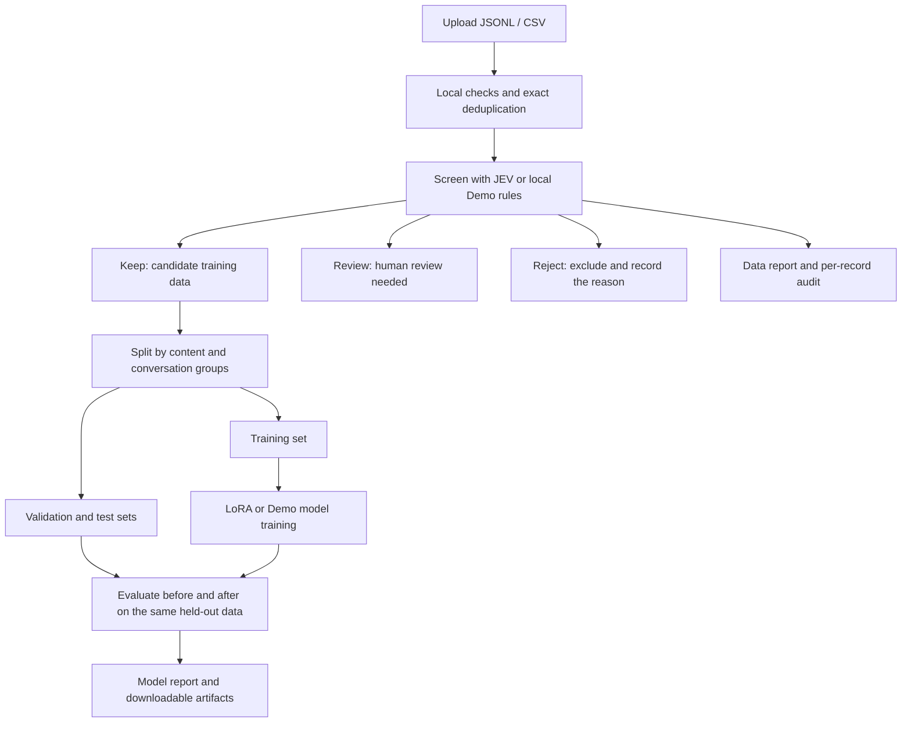

> 本页保存的是公开项目资料快照，阅读过程不需要连接 GitHub。

# JEV DataOps

**A traceable pipeline for general and domain-specific data: upload → screen → evaluate data → train a model → evaluate the result.**

**[Try the public browser demo](https://jev-dataops-demo.renaaaa2.chatgpt.site)** — no installation, API key, or GPU required. Click **Use example → Start workflow**, then inspect screening decisions, measured evaluation, and downloadable reports. You can also choose your own UTF-8 JSONL / CSV file (up to **2 MiB / 1,000 rows**).

The public demo processes files in your browser tab using local screening rules and a byte-bigram statistical model. It does not call JEV or train an LLM. Reloading clears its data and results, so download anything you need first. For domain-specific JEV screening, LoRA training, and larger datasets, use the self-hosted application below. Demo scope and build instructions.

Start with a local example on an ordinary computer, then connect a JEV screening provider and your own language model. The project includes a browser workbench, a CLI, and Python / HTTP APIs for developers and researchers who need to answer two recurring questions: “Is this dataset worth training on?” and “What changed after training?”

> **JEV evaluates the data; your target model learns from it.** This project calls the JEV API for screening. Subsequent fine-tuning updates the Hugging Face model you configure, not JEV itself.

**First time here?** Run the demo → Prepare your data → Enable JEV screening → Train a language model → Read the results

**More:** Domain adaptation guide · CLI and APIs · Larger datasets · Troubleshooting · Deployment and development

## What does the pipeline do?

| Step | What happens | What you get |
| --- | --- | --- |
| 1. Upload | Read JSONL / CSV, record file details, and preview the data | A reusable dataset |
| 2. Screen | Check format, length, and exact duplicates locally; live mode also asks JEV to assess quality | Three partitions: `keep`, `review`, and `reject` |
| 3. Evaluate data | Summarize partition counts, duplicates, errors, and JEV's decisions by dimension | A data report and per-record audit trail |
| 4. Train | Split retained records by group, then train the configured model | Training logs, dataset splits, and model artifacts |
| 5. Evaluate the model | Compare loss before and after training on the same held-out test set | A before/after loss and perplexity report |



**Data evaluation shows what passed screening; model evaluation shows what changed after learning from it.** Current model evaluation reports loss and perplexity. It does not measure business task accuracy, collect human ratings, or deploy models automatically.

## Use the same pipeline in your domain

The upload, screening, training, and evaluation workflow can be reused for financial research, coding assistance, enterprise knowledge, legal texts, or medical literature. Adapting it means supplying **your data, domain screening criteria, target model, and an independent task benchmark**. For example, enterprise answers may need support from a policy document, while financial text may need consistent dates, sources, and numerical definitions. Domain experts should define these criteria and calibrate them through small-sample review.

The project includes three **starter screening rubrics**: `general`, `finance`, and `code`. All cover quality, privacy, and trainability. Finance and code add domain context; they do not include fact-checking, code execution tests, or specialized business evaluation. Other domains can start from the general rubric. Over time, retain your rubric versions, screened datasets, model adapters, and evaluation results as reusable assets. Verify improvements in domain capability using your own task metrics.

→ Read the **Domain adaptation guide** for task selection, data preparation, rubric customization, evaluation isolation, and business metrics.


## 1. Run the local demo

You need **Linux or macOS, Python 3.10+, and Git**. The default demo requires no API key, GPU, or language-model download. Installing dependencies for the first time requires internet access.

### Install and start

```bash
git clone https://github.com/RenaGao/jev-dataops.git
cd jev-dataops

python3 -m venv .venv
source .venv/bin/activate
pip install -e .

jev-dataops serve
```

Keep the terminal running and open **http://localhost:8000** in your browser. The workbench connects to the local service you started. The GitHub repository page is not a hosted training service.

### Complete your first run in the browser

1. Under **Prepare your data**, click **Use example** to load the bundled synthetic dataset.
2. Leave **Screening engine** set to **Demo · Local rules**.
3. Leave **Training backend** set to **Demo · Pipeline validation** and enable **Auto-train and evaluate**.
4. Click **Start workflow**, then follow the stages, partition counts, and logs under **Runs & insights**.
5. When the run finishes, inspect **Held-out evaluation** and download results from **Artifacts & reports**.

The default example has 84 rows. Expect **80 kept, 2 for review, and 2 rejected**, with the retained data split into **56 training, 12 validation, and 12 test records**. These results confirm that upload, screening, training, and evaluation completed end to end.

> Demo screening uses local rules only. Demo training really trains a small byte-bigram statistical model. It validates the workflow; **it does not demonstrate JEV's judgment quality or language-model training performance**.


## 2. Bring your own data

Drag a file into the upload area or click to choose one. Check the preview before selecting your screening and training settings.

### Recommended: JSONL, one JSON object per line

Instruction-tuning data can look like this:

```jsonl
{"id":"sample-001","group_id":"conversation-001","instruction":"How do I change notification preferences?","input":"","output":"Open Settings, select Notifications, and adjust your preferences."}
{"id":"sample-002","group_id":"conversation-002","instruction":"What if I forget my password?","input":"","output":"Select the password recovery option on the sign-in page and follow the identity verification steps."}
```

These two rows illustrate the format only. Automatic training requires **at least 6 independent groups after screening**. Use more examples to create meaningful training, validation, and test sets.

The system supports four content layouts. **Choose one per record:**

| Data type | Required content fields | Typical use |
| --- | --- | --- |
| Plain text | `text` | Articles, passages, and domain text |
| Instruction and answer | `instruction`, `output`; optional `input` | Instruction tuning |
| Question and answer | `prompt`, `response` | Single-turn question answering |
| Conversation | `messages`, with string `role` and `content` in each item | Conversation training |

Conversation example:

```jsonl
{"conversation_id":"chat-001","messages":[{"role":"user","content":"What should I do if a file upload fails?"},{"role":"assistant","content":"Check the file format and your network connection, then try again."}]}
```

Supported roles are `system`, `user`, `assistant`, and `tool`; content must currently be text. If a record mixes layouts, the selection order is `messages`, `text`, instruction/answer, then prompt/response. Do not rely on mixed fields being combined into training content.

### CSV is also supported

Use field names in the first row and one record per subsequent row:

```csv
instruction,output,group_id
How do I change notification preferences?,Open Notifications in Settings and save your new preferences.,conversation-001
What if I forget my password?,Use password recovery on the sign-in page and complete verification.,conversation-002
```

Use standard CSV quoting for fields containing commas, double quotes, or newlines. A `messages` column must contain a JSON-encoded array. Direct `.xlsx` uploads are not supported; export them as UTF-8 CSV first.

### Why include a group ID?

Give records from the same conversation, document, or other indivisible unit the same `group_id` or `conversation_id`. The system keeps related records in one split to reduce training/test leakage. Identical normalized text also links records into the same group. Without explicit group IDs, grouping mainly relies on content hashes.

By default, independent groups are assigned approximately **70% to training, 15% to validation, and 15% to testing**. Row percentages vary when groups differ in size. Exact-duplicate checks do not identify paraphrases or semantic similarity.

**Input limits:** UTF-8 files; a default browser upload limit of 1 GiB; at most 1 MiB per record; and a default content length of 8–32,000 characters. Extra fields such as `id`, source, and group identifiers remain in the local partition files.


## 3. Enable live JEV screening

Configure a key for one of the following providers in the terminal that runs the service. If the service is already running, stop it and restart it after setting the environment variable.

**Through OpenRouter:**

```bash
export OPENROUTER_API_KEY='replace-with-your-openrouter-key'
jev-dataops serve
```

**Or connect directly to TypeSafe:**

```bash
export TYPESAFE_API_KEY='replace-with-your-typesafe-key'
jev-dataops serve
```

The providers' keys are not interchangeable. Refresh the page and select **JEV · OpenRouter** or **JEV · TypeSafe** under **Screening engine**.

For your first live API run, start with a small dataset and **disable Auto-train and evaluate**. Inspect the screening decisions and review volume before deciding to train.

### How are screening decisions made?

The default general rubric assesses content quality, apparent privacy exposure, and suitability for training. Format errors, length violations, and duplicates are handled locally first. The general and finance rubrics treat rows that differ only in whitespace as duplicates (`"dedupe": "whitespace"`); the code rubric matches exactly, because indentation inside a snippet can be the point of the row. JEV results are routed as follows:

| Decision | Meaning | What happens next |
| --- | --- | --- |
| **Keep** | Every dimension's answer falls in its keep set and passes that dimension's gate | Eligible for the training candidate set once screening completes |
| **Review** | A judgment is uncertain, a gate was not met, or a record / response needs checking | Written to the review file; excluded from automatic training |
| **Reject** | At least one dimension rejects the record, or a local rejection rule applies | Written to the rejection file with a recorded reason |

Decision precedence is **Reject → Review → Keep**. If one dimension requests review but another rejects, the record is rejected.

Each dimension has its own gate, declared in the rubric. JEV returns a probability for every option; a row is kept on a dimension when the argmax is in the keep set, the mass on the keep set reaches the gate's `min_probability`, and the mass on the reject set stays under `max_reject_probability`. A gate may also require JEV's separate `confidence` field to reach the run's confidence threshold (`use_confidence`). In the bundled rubrics `privacy` does; `quality` and `trainability` do not, because on clearly good rows JEV's confidence for those sits near 0.5 while the probability on the chosen answer is 0.7–0.9, and gating on it sent most of a clean dataset to review. The effective settings of every run are written to `data_report.json` under `thresholds`, and each audit row records which gate, if any, turned a keep into a review.

The original upload is retained. Download `review.jsonl` for manual inspection; the workbench does not yet offer per-record annotation or automatic feedback into training. Corrected records can be uploaded as a new dataset.

| Setting | Default | Meaning |
| --- | --- | --- |
| Confidence threshold | `0.85` | Minimum for JEV's `confidence` field on dimensions whose gate uses it (`privacy` in the bundled rubrics); it does not mean “85% of samples are correct.” Demo does not use this threshold |
| Concurrent requests | `4` | Concurrent screening tasks; live throughput depends on provider quotas |
| Request limit | `1000` | Maximum HTTP requests for this run, including retries; not a sample count or spending cap |
| Model | provider alias | `model` in the API, `--model` in the CLI: pin a JEV version such as `typesafe/jev-1.13-20260917` so a run's cache holds one model's answers. `data_report.json` lists the resolved models under `models` either way |

A malformed JEV answer is asked for once more before the row is sent to review with the validation reason in the audit. Rows JEV never answered for are counted under `unevaluated`; when they exceed 5% of a run, the run is `complete` but not `training_ready`, and automatic training waits for a retry. Token counts and the provider's reported cost are summed under `usage`; cache hits cost nothing and are not counted.

Incomplete screening due to an exhausted request budget, authentication failure, or network error blocks automatic training. Under **Application domain**, choose General (`general`), Finance (`finance`), or Code (`code`). You can also select the rubric through the CLI or API. Domain selection configures the starter rubric for live JEV screening; Demo does not perform semantic domain assessment. See the Domain adaptation guide to customize additional domains.

> **Live screening sends the selected content fields to the chosen third-party provider.** Remove sensitive information beforehand and confirm that you have permission to transmit the data. The model's privacy check happens after submission and cannot replace pre-upload redaction. The token in **Connection settings** is `JEV_API_TOKEN`, which controls access to the workbench; it is not an OpenRouter or TypeSafe key. The Python CLI does not read `.env` files on its own; pass `--env-file .env` to load one (existing environment variables win). Live screening honours `HTTPS_PROXY` and `NO_PROXY`, reaching the provider through a CONNECT tunnel with TLS still ending at the provider.

API references: [TypeSafe API](https://docs.typesafe.ai/api), OpenRouter decisions SDK. OpenRouter's decisions endpoint is currently alpha; the API and model availability may change.


## 4. Train a language model

Screening engine and training backend are independent settings. **Selecting live JEV screening does not automatically switch training to a language model.**

| Goal | Screening engine | Training backend / toggle |
| --- | --- | --- |
| Validate the complete workflow without API charges | Demo | Demo; enable automatic training |
| Screen and inspect data only | JEV · OpenRouter or TypeSafe | Disable automatic training |
| Fine-tune a language model after JEV screening | JEV · OpenRouter or TypeSafe | Hugging Face · LoRA; enable automatic training |
| Fine-tune a language model after local screening | Demo | Hugging Face · LoRA; enable automatic training |

### Install dependencies and choose the target model

In the same project directory and virtual environment, run:

```bash
pip install -e '.[train]'
export JEV_BASE_MODEL='HuggingFaceTB/SmolLM2-135M'
jev-dataops serve
```

For live JEV screening, keep the provider key from the previous section configured as well. Restart a running service to load changed environment settings.

Refresh the page, select **Hugging Face · LoRA**, enable **Auto-train and evaluate**, and start the workflow. Training and evaluation run **on the machine hosting the backend**, not in the browser.

The default small model is intended to validate the execution path. Set `JEV_BASE_MODEL` to a compatible Hugging Face model or local model directory. The first run may download model files; compute and memory requirements depend on the model. The default device selection prefers CUDA and otherwise uses CPU. Override it with `JEV_TRAIN_DEVICE`. Models must support standard causal LM loading, have an EOS token, use safetensors weights, and work without remote custom Python code.

### What happens during training?

1. After screening completes, read `keep.jsonl`. Review and rejected records do not participate in training.
2. Create training, validation, and test splits by group; stop if there are too few independent groups.
3. Measure the base model's loss on the validation and test sets.
4. Fine-tune LoRA adapters on the training set.
5. Evaluate again on the same validation and test sets, then save the adapters and reports.

**The defaults are a small validation run: 1 epoch, at most 20 training steps, batch size 4, and sequence length 256.** Sequence length counts tokenizer tokens for language models and UTF-8 bytes for Demo. Training stops at the epoch or step limit, and long records are truncated. A completed run therefore does not mean an entire large dataset was used for training. Actual steps, record visits, and losses are saved in `training_report.json`.

Use the HTTP or Python API or the CLI's training flags to adjust parameters for a full experiment; the browser has no training-step input. Rows with a prompt (instruction/output, prompt/response, conversations ending in an assistant turn) are rendered with the tokenizer's chat template when it has one, so the adapter learns the format the model is served in, and by default only the answer tokens contribute to the loss (`loss_mask: "answer"`; `"full"` restores plain causal SFT). Bare passages are learned in full. On CUDA the frozen base is held in bfloat16; the LoRA weights stay in float32. The learning rate warms up over the first tenth of the steps and decays linearly. `training_report.json` records the masking counts, dtype, LoRA rank and alpha, and whether a chat template was used. DPO / RLHF, distributed training, and automatic model publishing are not implemented.

The resulting `model/` contains **LoRA adapters and tokenizer files**. Inference still requires the original base model. See the training guide for additional configuration and limitations.


## 5. Read the results

### Inspect the data before interpreting model metrics

1. **Check partition counts.** How much was kept, sent for review, or rejected? A high retention rate means more data passed the current rules, not that accuracy is high.
2. **Inspect individual records.** Download the three partitions and use `audit.jsonl` to review decision reasons. Live JEV mode also records decision dimensions and model identifiers.
3. **Check what training actually did.** Verify split sizes, actual steps, the model used, and the truncation length.
4. **Compare test-set metrics.** Confirm that the data and measurement units match before deciding whether to expand the experiment.

| Metric | Meaning | How to read it |
| --- | --- | --- |
| `baseline_loss` | Test-set mean negative log likelihood before training, weighted by predicted token count | The baseline |
| `trained_loss` | The same measurement after training on the same test set | Compare with the baseline; usually lower is better |
| `delta_loss` | `trained_loss - baseline_loss` | Negative means lower loss; positive means higher loss |
| `baseline_perplexity` / `trained_perplexity` | Perplexity for the corresponding model | Compare within the same evaluation setup; usually lower is better |
| `split_counts` | Training, validation, and test row counts | Check retained data volume and the resulting split |

For example, a change from loss `2.50` to `2.30` gives `delta_loss = -0.20`. This illustrates the metric; it is not a promised training gain.

Demo metrics use UTF-8 bytes; language-model metrics use tokenizer tokens. **Do not compare them directly.** Lower test loss does not establish better business accuracy, factuality, or user experience. Those require task-specific evaluation and human validation. Repeatedly tuning against test results weakens test-set independence; reserve an external benchmark for final decisions.

### Where are the files?

By default, the workbench stores data in `.jev-dataops/` under the directory where you started the service—the project directory if you followed the quickstart. Change it with `jev-dataops serve --data-dir /your/data/path`. Each run has its own directory:

```text
.jev-dataops/
├── datasets/                     # Original uploads
├── metadata.sqlite3              # Dataset and run records
└── runs//
    ├── screening/
    │   ├── keep.jsonl            # Candidate training data
    │   ├── review.jsonl          # Records for human review
    │   ├── reject.jsonl          # Rejected records
    │   ├── audit.jsonl           # Per-record decisions and reasons
    │   ├── data_report.json      # Data statistics and completion status
    │   └── cache.sqlite3         # Screening result cache
    └── training-1/               # First training attempt
        ├── train.jsonl
        ├── validation.jsonl
        ├── test.jsonl
        ├── training_report.json # Parameters, steps, and loss history
        ├── model_report.json    # Before/after evaluation
        └── model/               # Model artifacts
```

Download partition files, reports, and model files under **Artifacts & reports**. Runs without training have no training artifacts. Failed runs may have only partial outputs; check the run status and report completion flags. The default run directory is included in Git's ignore rules.


## 6. Connect the CLI or APIs to your workflow

### Run from the command line

```bash
# Complete local Demo pipeline; use a new output directory for the first run
jev-dataops run --input examples/dialogues.jsonl --output /tmp/jev-demo-001

# Live JEV screening only; set TYPESAFE_API_KEY first
jev-dataops run --input /data/corpus.csv --output /data/selection-001 \
  --provider typesafe --trainer none --rubric general \
  --concurrency 4 --max-requests 1000

# Live screening + LoRA training; set OPENROUTER_API_KEY and JEV_BASE_MODEL
# and install training dependencies first
jev-dataops run --input /data/corpus.jsonl --output /data/llm-run-001 \
  --provider openrouter --trainer huggingface --rubric general \
  --confidence 0.85 --concurrency 4 --max-requests 1000
```

Replace the paths with your own input files and output directories. Set the live request limit according to dataset size and budget. A limit of 1,000 does not guarantee that 1,000 records can be screened because retries also count. CLI outputs use `screening/` and `training/` under the specified directory; the browser uses `training-1/` for its first attempt.

Run `jev-dataops run --help` to see supported options. The CLI prints progress and a short summary (decisions, requests, cost, resolved model, rows not evaluated) on stderr and the JSON report on stdout; `--quiet` leaves only the JSON. Screening takes `--model`, `--min-chars`, `--max-chars` and `--timeout`; training takes `--epochs`, `--max-steps`, `--batch-size`, `--learning-rate`, `--max-seq-length`, `--seed`, `--lora-r`, `--lora-alpha` and `--loss-mask answer|full`, with the same small defaults as the browser.

### Configure a training experiment through HTTP

Start the service, upload a file, and save the returned `id`:

```bash
curl -F 'file=@my-data.jsonl' http://localhost:8000/api/datasets
```

Replace `dataset_id` below with that ID, then create a run. This example makes live JEV requests and performs actual LoRA training, so complete the environment setup first:

```bash
curl http://localhost:8000/api/runs \
  -H 'Content-Type: application/json' \
  -d '{
    "dataset_id": "replace-with-the-uploaded-dataset-id",
    "provider": "openrouter",
    "trainer": "huggingface",
    "auto_train": true,
    "rubric": "general",
    "confidence": 0.85,
    "concurrency": 4,
    "max_requests": 1000,
    "epochs": 1,
    "max_steps": 100,
    "learning_rate": 0.0002,
    "max_seq_length": 512,
    "seed": 42
  }'
```

These parameters illustrate the request format; adjust the training scale to your data and compute. Check progress with `GET /api/runs/` or return to the browser. If the service uses `JEV_API_TOKEN`, add `-H "Authorization: Bearer $JEV_API_TOKEN"` to every API request.

See the running service's Swagger documentation for all endpoints. To call training directly or adjust batch size and split fractions, see the Python API example.


## 7. Work with larger datasets

Streaming reads, bounded concurrency, and disk-backed SQLite deduplication and caching avoid loading the whole dataset into Python memory. **This is currently a single-host workbench:** it executes one complete run at a time, with concurrent screening inside each run. Distributed queues, object storage, and resumable chunked uploads are not implemented. The model itself must still fit in memory / VRAM.

One reproducible local benchmark screened **100,000 synthetic records in approximately 16 seconds, with peak process memory of approximately 39 MiB**. Cache and audit writes are committed in groups of 500 rows or once a second rather than once per row, the cache runs in WAL mode, and each screening worker keeps one TLS connection to the provider open across requests. This measures local rules and the disk pipeline, not JEV API throughput or language-model training speed. See the benchmark notes for the environment, training steps, and reproduction commands.

Before scaling up, use a small sample to check the schema, screening rubric, and grouping. Then increase request budget and concurrency, followed by training steps. Improve the data based on reviewed examples from the `review` and `reject` partitions rather than retention rate alone. Reserve disk space for original uploads, partitions, audit logs, caches, training splits, and model artifacts.


## 8. Troubleshooting

| Symptom or question | Explanation and next step |
| --- | --- |
| JEV is marked “Not configured” | Set the provider's key in the backend process, restart the service, and refresh. Do not enter it in the workbench access-token field |
| Hugging Face is marked “Not installed” | Install `.[train]` in the same Python environment used to start the service, then restart |
| A `.json` / `.xlsx` upload fails | The browser accepts `.jsonl` / `.csv`. JSONL has one object per line, not a single JSON array |
| Too few independent groups | Retained data must contain at least 6 independent components. Shared conversations or duplicate content can join multiple rows into one group; do not change IDs merely to bypass this check |
| A run fails or exhausts its request budget | Inspect the error and data report. Failed / cancelled browser runs can be retried using their screening cache. A retry uses the original configuration and receives a fresh request budget of the configured size |
| I want a different threshold, budget, or training backend | Change the configuration and create a new run. Retrying does not change the original configuration, and the cache is not shared globally across all new runs |
| Does retry resume the previous training attempt? | Screening can reuse successful cached decisions. Training starts over in a new directory such as `training-2/`; it does not restore optimizer state |
| A repeated CLI run says training artifacts already exist | CLI screening can reuse its directory, but training does not overwrite existing artifacts. Keep previous results and use an empty directory for new training. The browser provides a simpler retry flow |
| Training finishes quickly or visits only a few dozen records | Check `max_steps`, epochs, and actual record visits. The default 20-step limit is for workflow validation |
| Model download fails or the device runs out of memory | Check model access and device resources. Choose a compatible model that fits, or point `JEV_BASE_MODEL` to a prepared local model directory |
| Loss did not decrease | This can be the real result. Inspect the data, split, and training configuration, then run task evaluation. Fine-tuning gains are not guaranteed |
| A run is marked failed after a service restart | Unfinished runs are marked interrupted. Retry to reuse the screening cache; interrupted work is never reported as completed |


## 9. Deployment, development, and scope

### Start with Docker

```bash
export JEV_API_TOKEN='replace-with-a-long-random-access-token'
docker compose up --build
```

Open http://localhost:8000 and enter the same token in **Connection settings**. The default Docker image includes the web workbench and Demo runtime. Real language-model training requires training dependencies and a suitable device environment. Remote team use also needs HTTPS, access controls, and a data storage plan. See the deployment guide.

### Validate local development

```bash
pip install -e '.[dev]'
pytest -q
python -m build
```

With `.[train]` installed, the tests also perform a real LoRA training check using a tiny local Transformer. This test does not download a model or demonstrate the business performance of any pretrained model.

| Included | Not yet implemented |
| --- | --- |
| JSONL / CSV uploads and streaming screening | Native Excel parsing, audio quality evaluation |
| JEV keep/review/reject routing, per-record audits, cached retries | Annotation workbench, semantic deduplication, accuracy calibration against human gold labels |
| Group-aware splits, LoRA SFT, before/after loss evaluation | DPO / RLHF, multi-machine training, business benchmarks, automatic deployment |
| Local workbench and shared access token | Tenant isolation, a complete SaaS user system |

**License and contributions:** Source code is licensed under MIT. Model weights and third-party APIs have their own terms. This is an independent community project, with no affiliation with or endorsement by TypeSafe or OpenRouter. See CONTRIBUTING.md to contribute and SECURITY.md for security reporting.
