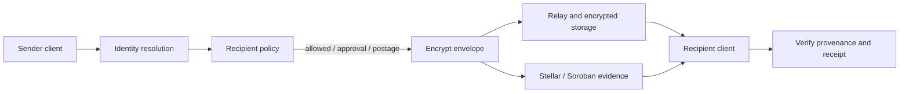

> 本页保存的是公开项目资料快照，阅读过程不需要连接 GitHub。

# Hush — private, programmable mail on Stellar

> **Your inbox. Your rules. Proof for every delivery.**

*图片：CI*
*图片：MIT License*

| Review item       | Current status                                                                                                                                                                     |
| ----------------- | ---------------------------------------------------------------------------------------------------------------------------------------------------------------------------------- |
| License           | MIT; see `LICENSE`                                                                                                                                                      |
| Development       | Local application and testnet development paths; beta software                                                                                                                     |
| Hosted experience | No verified public Hush demo URL yet; the screenshot-like panel below is an illustration                                                                                           |
| CI / deployment   | Check the latest CI run and deployment notes; CI success and deployment are separate |
| Contributions     | Public issues and pull requests are welcome; see `CONTRIBUTING.md`                                                                                              |

Hush is an open-source beta for private email built around Stellar identity and programmable inbox access. Mailbox owners can decide how unfamiliar senders reach them: allow a verified identity, request approval, require postage, or block the sender. Encrypted message content stays off-chain; Stellar is used for identity and verifiable protocol actions.

**Project status:** beta. The application, API, relay, protocol, and Soroban contracts are in this repository. Local development and testnet paths are available. Production readiness and a public hosted demo are separate deployment milestones; check the deployment status before relying on any endpoint.

*图片：Hush product and visual identity overview*

_Product and design overview. The message flow is conceptual and does not claim that a hosted mail service is available._

## Why Hush exists

Email makes it easy for anyone to contact an inbox, but the recipient has few tools to set admission rules before a message arrives. Hush explores a different model: senders present verifiable identity and meet the policy selected by the recipient. That can make abuse more costly, give recipients better control, and make delivery claims easier to inspect.

Hush is not a replacement for Stellar wallets and does not put private message bodies on-chain. The Stellar layer supports identity, policy, postage, receipts, and lifecycle evidence. Relays and encrypted object storage carry message payloads.

## How a message flows

1. **Resolve the sender.** A Hush address or Stellar account is resolved to an identity and the keys needed by the client.
2. **Evaluate the recipient’s rules.** The sender learns which admission requirements apply, such as trusted-sender access, verification, explicit approval, or postage.
3. **Encrypt and submit.** The client prepares an encrypted envelope and sends it through the relay or configured storage path.
4. **Record protocol evidence.** Where the configured chain adapter is enabled, postage and delivery state can be associated with Stellar contract records and receipts.
5. **Inspect the result.** The recipient can review sender provenance, delivery state, and available proof details in the client.



This diagram describes the intended protocol path. Which steps are active depends on the runtime profile and configured adapters; local demos use synthetic data and are not evidence of a production mail service.

## Product capabilities in this beta

| Area                      | What the repository contains                                                                     | Where to look                                                                                          |
| ------------------------- | ------------------------------------------------------------------------------------------------ | ------------------------------------------------------------------------------------------------------ |
| Inbox and sender requests | Mailbox views, message actions, sender review, and recipient policy flows                        | `src/features/mail/`, `src/features/requests/`         |
| Identity                  | Stellar account and federation resolution, wallet linking, and sender provenance                 | `src/features/identity/`, `src/services/stellar/`   |
| Encryption                | Message-envelope, attachment, key-derivation, and recipient wrapping code with synthetic vectors | `src/services/crypto/`, `protocol/messages/`             |
| Relay and storage         | Message submission, relay authentication, encrypted object storage, and delivery state           | `src/services/relay/`, `src/services/storage/`         |
| Stellar contracts         | Soroban contracts for sender policy, postage, receipts, and message lifecycle                    | `contracts/soroban/`                                                             |
| Proof inspection          | UI and API types for inspecting sender and delivery evidence                                     | `src/features/proof-inspector/`, `src/server/api/` |

These are implementation areas, not a promise that every feature is available in a shared hosted environment. Some paths require testnet configuration, operator-managed services, or secrets and are intentionally not enabled in public demos.

## Try the project

### Local application

**Requirements:** Node.js 24 or newer and Bun 1.3.14. Rust is needed to build or test the Soroban contracts; use the version pinned in `rust-toolchain.toml`.

```sh
git clone https://github.com/Stellar-hush/hush.git
cd hush
bun install --frozen-lockfile
cp .env.example .env
bun run dev
```

The Vite development server prints the local URL when it starts. The default development profile is intended for local work and uses development adapters. Use test accounts and synthetic messages. Do not paste wallet seeds, real user content, production tokens, or private keys into `.env`, fixtures, screenshots, logs, issues, or pull requests.

### Useful commands

```sh
bun run format:check       # formatting
bun run lint               # lint
bun x tsc --noEmit         # TypeScript types
bun run test               # unit tests
bun run build              # production bundle / worker build
```

Contract-focused work should also run the relevant commands in `contracts/soroban/`. See contributor setup for the repository workflow and security verification for security-specific checks.

## Documentation map

- Product overview and walkthrough — audience, product model, user flows, beta boundaries, and review path.
- System architecture — trust boundaries, components, request flow, and module map.
- API guide — endpoint groups, authentication, errors, and local examples.
- Protocol guide — message envelopes, identity, postage, and interoperability notes.
- Security documentation — threat model, controls, remaining risks, and verification checklist.
- Deployment status and runbooks — environments, configuration, release gates, and deployment evidence.
- Contributor guide — supported tools, checks, ownership boundaries, and pull-request expectations.
- Stellar Wave maintainer brief — project fit, contributor opportunities, and application preparation.
- Brand and compatibility migration — remaining legacy domains and identifiers that require coordinated cutover.

## Stellar and Soroban

Hush uses Stellar as a programmable identity and protocol-evidence layer. Soroban contracts in this repository define policy, postage, receipts, and lifecycle behavior. The client and services include adapters that connect those contracts to message admission and delivery flows. Contract code, deployment manifests, and environment configuration have distinct roles; a local contract build is not proof that a contract is deployed or that a live application is using it.

The system is designed to keep message bodies and attachments out of public ledger state. Ledger transactions and contract events can still reveal operational metadata such as account relationships, payment amounts, timing, and public contract activity. Review the metadata policy before handling sensitive data.

## Contributing

Good contribution areas include protocol interoperability vectors, contract failure-path coverage, relay reliability, accessible inbox and sender-request flows, and clear operator documentation. Wave issues should be bounded, independently testable, and possible to complete without production credentials or private user data.

Start with `CONTRIBUTING.md`, then read the relevant module guide. The project uses a review-first workflow: discuss large changes in an issue, keep changes focused, include exact validation results, and never add secrets or real message content to the repository.

Hush has an MIT license; see `LICENSE`. Participation in the Stellar Wave is subject to organizer approval and the program’s current rules. The [maintainer guide](https://docs.drips.network/wave/maintainers/participating-in-a-wave/) explains how to apply a public repository, add issues after approval, and manage contributor assignments.

## Beta boundaries

- Hush is experimental software. Do not use it as the sole channel for sensitive, urgent, or legally required communication.
- A testnet deployment does not provide production availability, email deliverability, or financial guarantees.
- Existing federation domains, API headers, signature domains, deployment resources, and storage keys still use legacy identifiers. They remain for compatibility until their migrations are coordinated; see the migration guide.
- A public landing page or hosted preview is not equivalent to a production mail service. Check the deployment status for the current verified endpoint and its limitations.

## License

Hush is distributed under the MIT License.
