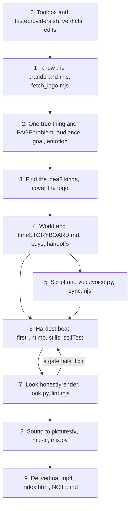

> 本页保存的是公开项目资料快照，阅读过程不需要连接 GitHub。

Your keyframes get a face rating: first the default (mid), then the measured version (maxxed). Typography and vector only, no photo of anyone, made with the skill's own runtime. Watch the MP4 &middot; how it was made and checked


# motionmaxxing

**Looksmaxxing for motion graphics.**

An agent skill that turns AI slop videos into films that look made by a motion designer.


[*图片：X*](https://x.com/makwanatejas170)
*图片：Agent skill*
*图片：Node 22+*
*图片：Chrome + ffmpeg*
*图片：Measured*
*图片：Gates*
*图片：Status*
*图片：License: Apache-2.0*
[*图片：Lives inside FinalMotion*](https://finalmotion.video)

**Follow [@makwanatejas170](https://x.com/makwanatejas170) on X** for the next glow-ups. Lives inside **[FinalMotion](https://finalmotion.video)**.

The glow-up &nbsp;·&nbsp; Why your AI video is mid &nbsp;·&nbsp; The science of the mog &nbsp;·&nbsp; The protocol &nbsp;·&nbsp; Mog check &nbsp;·&nbsp; Install &nbsp;·&nbsp; Start maxxing &nbsp;·&nbsp; Toolbox


Your AI video is mid. Not broken, not ugly, just undecided: a label in the corner, a headline on the left, a card on a flat colour, a fade between every beat. **motionmaxxing** is an agent skill that makes launch films, product promos, brand stings and kinetic-type pieces, and makes them on purpose. Give it a website and it captures the brand, finds an idea only that brand could own, builds a world for it, and animates with timing measured frame by frame from 53 professional motion moments. Then it renders the film and looks at it with scripts, instead of telling you it came out well. It runs in Claude Code and in any agent that reads a `SKILL.md` folder. Everything renders locally from plain HTML.

Motionmaxx it, then check the numbers.

Early release. Still getting sharper, and more is coming soon.

**The rating scale**

| Rating | What it looks like on screen |
|---|---|
| **Slop** | A slide deck that moves: corner labels, a counter, a left headline beside a card, fades everywhere |
| **Mid** | Clean and competent, and nobody decided anything: default eases, flat grounds, a held end card |
| **Maxxed** | One idea, a world with light and texture, measured motion, cuts on motion, and gates that pass with the numbers shown |

The skill's job is to move a film one notch right and to say honestly which notch it landed on.

## The glow-up

Three before / after comparisons. In each, the same brand is filmed twice: once without the skill (mid) and once with it (maxxed). The brands belong to their owners and are used only to show the difference (see Ethics and credits).

**Cluely, mid to maxxed. Same model, same brief: both films were generated with GPT-6.1.** Left: without the skill. Right: with it. You don't need the most expensive model to get motion that looks designed. The difference is the skill, not the price tag. Watch the MP4 (30 s with sound, 1920x600).

*图片：Cluely, without the skill on the left and with it on the right, both generated with GPT-6.1*

The left film is a slide deck: a brand label top-left, a "REAL-TIME ASSISTANCE" tag top-right, a held left headline in two colours, two cards, and a "02 / 05" counter. The right film is the product: the real assist overlay on a lit desktop, the ⌘ + ↵ shortcut as physical keys, then the overlay sitting on a live call.


**Spotify, mid to maxxed.** Left: without the skill. Right: with it. The without arm is a left headline beside a phone mock-up in every frame. The with arm carries one idea (the green full stop becomes a switch, floods the frame, and becomes the icon) through type, a wall of lines that collapses, and a full-bleed ending. Watch the MP4 (15 s, 2560x720).

*图片：Spotify, without the skill on the left and with it on the right*


**Wispr Flow, mid to maxxed.** Top: without the skill. Bottom: with it. Watch the MP4 (24 s with sound, 1080x1440).


*图片：Wispr Flow, without the skill above and with it below*


**What to look for**

- In the top film, small labels sit in the corners of most frames and a headline block is held on the left over a card. That is the pattern gate G5 exists to fail.
- In the bottom film, the type is the picture, nothing sits in a corner, and the grounds change with the idea.
- The comparison is 24 s with sound: the bottom film is cut to its voice and music.

**What the skill is claiming.** Not that the bottom film is perfect. That it was decided (what to film, how it moves) and then checked, and the top one was not. Glow-up, not a miracle.


## Why your AI video is mid

Most AI motion graphics fail in the same recognisable way: everything is a slide. A slop autopsy of rejected AI films ranked 25 default patterns. These are the loudest tells, and what catches each one.

| The tell | What it looks like | Caught by |
|---|---|---|
| **Page chrome** | A brand name in a corner, a "02 / SPEAK" counter, a timecode, corner brackets, a progress bar | `lint.mjs` (G5), rules C1-C6, P1 |
| **Deck layouts** | A held left-aligned headline, a kicker above it, "headline left, device right" | `lint.mjs` (G5), rules C7, D1 |
| **Letter-typed headlines** | A headline typed out character by character with a caret | `lint.mjs` (G5), rule T1 |
| **Vibe-coded UI cards** | A rounded card with a status dot and "label . value", a "Good morning" header, zinc greys | `lint.mjs` (G5), rules V1-V5 |
| **Flat swatches** | A different flat colour per scene, or a small card floating on a void | Your eyes on the contact sheet (`references/world.md`) |
| **Dead frames** | Runs of frames where nothing on screen moves | `look.py` (G2): more than 3 flat frames in a row fails |
| **Fades everywhere** | Every element arrives by opacity and every beat ends in a dissolve | Measured instead: pros use 3,392 transform entries against 584 opacity fades, and cut on motion |

Several of these were prescribed by earlier wording of the skill itself ("alternate flat grounds", "a recurring carrier"), so the fix was an edit to the skill, not a scolding for the agent. The lint is a lead, not a verdict: it cannot see text inside an image or a canvas.

## The science of the mog

Most "motion design skills" are a list of opinions. This one started with a measurement.

- **53 frame-accurate pro moments** were decoded by **6 parallel AI analyst agents** (reviewed by a human) into about **150 designer rules**, each as WHEN / DO / BECAUSE with evidence.
- Every composition was **seeked frame by frame**. That gave about **4,300 distinct moves** (4,288) and **12 measured eases**.
- A **slop autopsy** of rejected AI films ranked 25 default patterns, and traced which ones the skill's own wording had caused.
- That was merged with **judgment from earlier generations**: the author's blind A/B rounds on an earlier generation of the skill (9 of 10 picks went to the with-skill film; one rater, so read it as a signal, not a benchmark), and a measured re-analysis of everything made so far.
- The result is checked by **scripted gates** and a **page-chrome lint**.


  
  
  


### The numbers a designer can use

| Finding | Measured |
|---|---|
| The median move | **10 frames** (0.33 s). Entries 11-12 f, opacity 6 f, blur 7-8 f |
| Landing vs leaving | **Landing decelerates** (58% ease out); **leaving accelerates** (37% ease in, against 16% of landings) |
| Overshoot | **Under 9%** of moves (8.8%), and late: a slow lean past the mark, not a fast spring |
| Arrival | Decelerates **from oversize**. Logos crash in from about 3.5x. **Nothing grows from zero** |
| Fades | Elements arrive by moving: **3,392 transform entries against 584 opacity fades** |
| Cuts | Pros **cut on motion**, not on rest. 96% of moments use hard cuts, about 20 per moment |
| Dead frames | In the 3-7 s pro moments, motion on **about 99% of frames** (median still run: 1 frame). Whole films breathe more; the skill treats that as a question, not a target |
| The ending | A resolved end hold of 0.6-1.4 s; the ending usually gets smaller |

### The protocol is fundamentals

Looksmaxxing is mostly boring fundamentals done consistently. So is motion design. The translation, with the measured finding behind each:

- **Jawline = the hard cut.** Pros cut on motion. Scenes start already moving and clips end mid-move. A fade to black is a default, not a decision.
- **Mewing for your frames = no dead frame.** In the 3-7 s pro moments, something moves on about 99% of frames. Gate G2 fails a run of more than 3 flat frames.
- **Skincare = grain and light.** A ground is a surface, not a swatch: light, depth and texture on every frame. The hero moment gets the hardest work (real 3D, a generated plate, a dense composition).
- **Posture = land decelerates, leave accelerates.** The same object on the wrong curve reads as floaty or as thrown. That single rule is most of the difference between "animated" and "directed".
- **Nothing grows from zero.** Things arrive by decelerating from larger than life, or by moving in from the edge.

### Two more findings worth stealing

- **Page chrome is the number one slop tell.** A brand name in a corner, a "02 / SPEAK" counter, a timecode, corner brackets: in the autopsy these were the strongest signal that no one decided anything. The lint catches them by geometry and typography.
- **A fix is often an edit to the skill.** Several default tells had been prescribed by earlier wording ("alternate flat grounds", "a recurring carrier"). The skill was rewritten, not the agent scolded.

The full account, with the method and the caveats, is in docs/HOW-IT-WAS-BUILT.md.

## The protocol

Ten steps, the same order every time. The agent shows you the idea and the storyboard before it builds, then fixes in a fixed order when a gate fails.



Dashed steps are optional: voice and sound need an ElevenLabs key, and some films are better silent.

## Mog check

A gate that fails is fixed, not argued. Scripts print the numbers and the agent quotes them in `NOTE.md`. Two gates have no script, and the agent has to say so.

| Gate | Pass condition | Computed by | The vibe |
|---|---|---|---|
| **G0** render exists | Decodes, is not blank, the picture moves, the length matches the plan, audio is present when planned | `look.py` | show up |
| **G1** proof readable | UI text at least 0.04 H; the fragment at least 0.55 W or cropped by the frame; lit, in a world; magnified by the camera | by eye on the contact sheet | no squinting |
| **G2** no empty frame | No run of more than 3 consecutive flat frames | `look.py` | mewing for your frames |
| **G3** end card short | End hold at most 1.4 s; the final shot at most 25% of the film | `look.py` | do not overstay |
| **G4** one hero per frame | Two panels only if one has twice the area of the other, or the camera moves between them | by eye on the contact sheet | one main character |
| **G5** no page chrome | No corner labels, tracked-caps labels, counters, timecodes, header or footer bars, kicker over a headline, left headline block beside right-side media, progress bars, letter-typed headlines, or vibe-coded UI cards | `lint.mjs` | take the lanyard off |


  


## Install

**Requirements:** Node 22+, Python 3, ffmpeg, Google Chrome. Optional: an ElevenLabs key for voice, sound effects and music (`ELEVENLABS_API_KEY`); the Codex CLI with image generation for surface plates.

**Claude Code**

```bash
git clone https://github.com/Tejashmakwana/motionmaxxing ~/.claude/skills/motionmaxxing
bash ~/.claude/skills/motionmaxxing/install.sh        # checks the requirements; installs nothing system-wide
```

Or, from a checkout somewhere else: `./install.sh` links it into `~/.claude/skills/motionmaxxing`. Flags: `--dir PATH` for another skills folder, `--copy` to copy instead of symlink, `--force` to replace an existing install.

**Other agents.** The skill is a folder with a `SKILL.md` at its root. Point any agent that reads `SKILL.md` at the folder (or copy it into that agent's skills directory) and give it shell access. The scripts only need `node`, `python3` and `ffmpeg` on the path.

**Check your machine**

```bash
bash scripts/providers.sh        # JSON: chrome, ffmpeg, key, codex, disk. Never installs anything.
```


## Start maxxing

In Claude Code, run `/motionmaxxing` or just ask in plain language. The skill triggers on any request to make, plan, storyboard, fix or critique a motion graphic.

1. **From a URL**
   > /motionmaxxing make a 20s launch film for https://example.com. I want to see the idea and the storyboard before you build.
2. **A single moment**
   > /motionmaxxing a 6 second kinetic-type sting for our brand: the one line "Ship it" with real 3D on the mark. Silent is fine.
3. **Rate and repair a mid video**
   > /motionmaxxing here is `draft.mp4` and its `index.html`. Rate it slop, mid or maxxed, run the gates, tell me what fails, and fix it.

**What you get**

| File | What it is |
|---|---|
| `film/final.mp4` | The film, with sound when a key is set |
| `film/index.html` | The editable source: plain HTML plus the `Motion` runtime, reproducible frame by frame |
| `film/STORYBOARD.md` | The plan: page, brand inventory, the chosen idea and why, per-act world, the beat table with what each beat buys |
| `film/NOTE.md` | The honest account: the idea, what is real and what is illustrative or generated, the G0-G5 numbers from the scripts, what you would still improve. The agent never certifies the film as good |

## Toolbox

Every script prints `--help`. Zero dependencies unless noted. Full flags in `references/tools.md`.

| Script | What it does |
|---|---|
| `scripts/providers.sh` | Reports what the machine has: Chrome, ffmpeg, key, Codex image generation, free disk |
| `scripts/brand.mjs` | Captures a site's brand: `brand.json`, `BRAND.md`, `board.png`, logo, fonts, screens, media |
| `scripts/fetch_logo.mjs` | Fetches an official mark from SVGL, Simple Icons, or the site, and never redraws one |
| `scripts/precedent.py` | Rule-only precedent per beat from `library/moments.jsonl` (716 rows) |
| `scripts/imagegen.py` | Generated surface plates, with a guard that refuses text, logos, UI and people |
| `scripts/voice.py` | ElevenLabs voice-over, sound effects, music, music fitting, and word alignment |
| `scripts/sync.mjs` | Word timings to frames, for cutting picture to the voice |
| `scripts/mix.py` | Voice, music and hits to one -14 LUFS / -1 dBTP mix, with predictable ducking |
| `scripts/render.mjs` | Deterministic frame-by-frame render through Chrome and ffmpeg; stills, shutter blur, grain |
| `scripts/look.py` | Contact sheet, cuts, end hold, audio audit and gates G0, G2, G3 |
| `scripts/lint.mjs` | The page-chrome lint, gate G5 |
| `scripts/blind_review.py` | A randomised, blind A/B page for choosing between versions |

### Runtime highlights

`runtime/motion.js` is one plain `` on top of GSAP, with no build step. The API is in `runtime/README.md`.

- **12 measured eases** by name (`M.ease.softLand`, `snapSettle`, `accelExit`, ...), also accepted anywhere an ease is.
- **Seek-safe.** Every frame is a pure function of time; jumping to any frame equals playing to it. `Motion.selfTest` proves it, including canvas pixels.
- **Words, typing, cursor, press, count, camera, snap, dive, whip, smear,** all authored in frames with measured defaults.
- **`hero3d`.** A Three.js hero object (a logo extruded from SVG, a coin, a glass slab, a phone) with real light and depth, on the same clock. Three.js is vendored; no CDN, no build.
- **`native-ui`.** True-proportion iOS furniture (phone, lock screen, notifications, tab bar) for when a product's real UI cannot be captured.

### Repo map

```text
SKILL.md              the skill: laws, "never ship" list, gates, the 10-step process
references/          the craft, one topic per file (judgment, idea, world, motion, type, slop, tools, ...)
runtime/             motion.js, hero3d/, native-ui/, fonts, vendored GSAP and Three.js
scripts/             the toolbox above
templates/film.html  the starting film
examples/            demo, 3d-hero, phone, selftest (must print PASS)
library/             moments.jsonl: rule-only precedent rows
taste/               verdicts and edits: what was rejected and the before/after fixes
studies/             two calibration strips of invented brands, and where they come from
docs/                hero source, showcase media, HOW-IT-WAS-BUILT, KNOWN-LIMITS
install.sh           requirement check, then link or copy into a skills folder
LICENSE, NOTICE      Apache-2.0, and the bundled third-party components with their own licenses
```

## Built by

**Tejas Makwana**

- X: [@makwanatejas170](https://x.com/makwanatejas170)
- GitHub: Tejashmakwana

This skill lives inside **[FinalMotion](https://finalmotion.video)**.

The full research and engineering story, with the method and the numbers, is in **docs/HOW-IT-WAS-BUILT.md**: the corpus, the six analysts, the frame-by-frame curves, the slop autopsy, the merge with earlier generations, and what each gate was born from.

## Ethics and credits

- **Learned from private study of published films.** The films that were studied are not in this repo and are not redistributed. The skill ships principles in its own words and measured numbers. No third-party frame, clip or copy is included; the calibration strips in `studies/` are original images of invented brands.
- **Showcase brands.** Cluely, Spotify and Wispr Flow belong to their owners. They appear only in the three before/after comparisons, to demonstrate the difference. These are unofficial demonstrations and are not affiliated with or endorsed by those companies.
- **Generated images** are for a missing surface only, never text, logos, UI or people shown as real, and are declared in `NOTE.md`.
- **Third-party code and fonts** are not covered by Apache-2.0 and keep their own licenses: [GSAP](https://gsap.com) 3.12.5 ([GreenSock Standard License](https://gsap.com/standard-license), which is not open source: you must comply with its terms), [Three.js](https://threejs.org) r186 (MIT), [opentype.js](https://opentype.js.org) (MIT), [Inter](https://rsms.me/inter/) (SIL OFL 1.1). See NOTICE; license files sit beside the vendored code.
- **License:** Apache-2.0, the same license HyperFrames uses. Use it, fork it, ship it commercially. Keep the NOTICE with your copy.

## Status and known limits

Early release, so a glow-up in progress. It works end to end on the author's machine and has been used on a handful of real briefs, but it has not had a wide test. Known limits, said plainly in docs/KNOWN-LIMITS.md: the lint cannot see text inside a canvas or an image; G1 and G4 are judged by eye; ElevenLabs music does not always hit tempo or length; WebGL renders run at about 7-11 fps; the sound-effect normaliser can corrupt very short clips; `look.py` treats show and hide events as cuts; and `fetch_logo.mjs` can return a header ribbon instead of the mark.

## License

Open source under Apache-2.0. Bundled third-party components (GSAP, three.js, opentype.js, Inter) keep their own licenses: see NOTICE. Brand names in the showcase belong to their owners.
