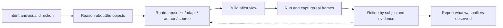

> 本页保存的是公开项目资料快照，阅读过程不需要连接 GitHub。

Turn an idea into a 3D scene worth exploring.


  
  
  
  
  


  


  Visual inspiration, not a benchmark. An author-supplied project recorded before this skill existed; its UI contains Vietnamese. Historical footage, not an English demo or a runtime test of the skill — see media provenance.


  Landing page ·
  Install ·
  Examples ·
  Skill ·
  Prompts ·
  Compatibility


---

## What it is

A standalone agent skill for creative 3D visualization: shape the world, model its rules, make it interactive, and check what actually appears on screen. It ships a ten-step workflow, a searchable catalog of recipes and reusable knowledge, runnable Three.js templates and kits, and a capture helper so the agent inspects the frames it rendered instead of describing them. Factual explanations need sources; animated decoration does not become a simulation just by moving.

Start with one sentence:

> Use 3dviz-pro-max to build a small fantasy village I can explore. Choose a distinctive art direction, add a few moving creatures, and inspect the result.

You do not need to choose a renderer or fill out a specification first. The agent should use the existing project stack, choose an appropriate representation, and refine the scene from observed results.

## What it draws today

Runtime captures on a real GPU from the skill's own kits, rigs and recipes — all twenty-one frames, with host, tiers and hashes, are in the showcase gallery.

| | | |
| --- | --- | --- |
| [](docs/demos/showcase/village-dusk-golden-hour.jpg)The whole island at dusk from the home camera. | [](docs/demos/showcase/village-night-lantern-river.jpg)Night: lantern practicals are the only key light. | [](docs/demos/showcase/village-tilt-shift-diorama.jpg)Same island as a tabletop model, 22° lens. |
| [](docs/demos/showcase/timber-cottage-t3-closeup.jpg)Timber cottage at T3, the Blender-baked hero. | [](docs/demos/showcase/stone-bridge-over-water.jpg)Stone bridge over the running water surface. | [](docs/demos/showcase/coupled-gears-studio.jpg)A 24/16-tooth spur pair, module 10 mm, ratio 3:2. |

Village frames come from the retired pilot revision at mixed tiers; kit frames use the blueprint proof harness at the tier named. Nothing is cropped or retouched, and no frame claims a tier its record calls missing.

## What ships

As of 2026-09-10, from `catalog-summary.json` and the docs below:

| | Count | Notes |
| --- | ---: | --- |
| Recipes | **223** | across all 24 registered directions, at least six each |
| Knowledge records | **440** | 18 populated families; 69 carry authored numeric `defaults` |
| Kit blueprints | **22** | record + module + four real captures, re-checked by SHA-256 |
| Style profiles | **37** | 33 with numeric defaults, including five named looks |
| Directions | **24** | see the subject table below |
| Sources / evidence events | **451** / **3,599** | public evidence archive |
| Example studies | **37** | five chapters, each runnable (examples) |
| Showcase frames | **21** | headless Chromium, GPU, 1920×1080 (gallery) |
| Retrieval cases passing | **249** | authored known-intent cases |

The landing page recomputes every one of these from `skills/`, `docs/`, `evals/` and `evidence/` at build time, so a number cannot drift from the data behind it.


The 24 directions and their authored subjects

| Direction | Authored subjects |
| --- | --- |
| Environments | Fantasy village, terrain island, historical evidence layers; Cave networks, night markets, floating archipelagos; irrigation budgets, museum routes and branching storybooks |
| Characters and motion art | Puppet performance, creature patrol, ribbon sculpture; Winged flight, expression/gaze rigs, secondary-motion chains; branching storybook scenes |
| Products and assemblies | Speaker parts, folding lamp, camera rig; Bicycle ratios, mould draft, flat-pack assembly |
| Architecture and interiors | House cutaway, furniture layout, service layers; Stair geometry, clearance studies, daylight/shading; construction sequence playback, museum routes and room modes |
| Operations and logistics | Parcel sorter, picking tour, dock scheduling; Job-shop playback, AGV reservations, pallet loading; closed-lane traffic and construction sequencing |
| Anatomy | Heart cutaway, knee layers, skeletal hierarchy; Brachial plexus routing, hepatic portal routes, vertebral columns; dental motion and supplied brain atlases |
| Physiology and biomechanics | Sarcomere, ventilation phases, vessel resistance; Cardiac valve phases, muscle levers, classical capillary exchange; moving-hinge jaw illustration |
| Molecules and materials | Molecular geometry, unit cells, hydrogen bonds; Protein secondary structure, chirality, crystal slip planes; deposited binding sites and orbital isosurfaces |
| Solid geometry | Conics, folding nets, solids of revolution; Convex hulls, Delaunay cells, Minkowski clearance |
| Linear algebra | Basis maps, determinant/volume, cross product; Eigenvectors, SVD, orthogonal projection; single-qubit Bloch ball, two-qubit Bell correlations, attention aggregation and small-network activations |
| Calculus and fields | Directional derivative, double integral, divergence/flux; Field integration, curl/circulation, Hessian critical points; finite Fourier synthesis, reciprocal complex mapping, Mandelbrot and quadratic Julia escape orbits, a linear phase portrait; predator-prey phase time and loss slices |
| Probability and statistics | Binomial trials, normal density, sampling means; Covariance ellipsoids, Markov chains, Monte Carlo volume |
| Topology and symmetry | Moebius band, torus cells, square symmetries; Trefoil diagrams, tolerance-based symmetry, mesh orientability; Riemann sphere reciprocal map |
| Logic and circuits | Boolean gates, full adder, finite-state machine; Critical paths, setup/hold timing, pipeline throughput; bounded natural deduction, SAT refutations and linear-arithmetic SMT |
| Algorithms and data structures | BFS, Dijkstra, stable mergesort; Binary heaps, recursion stacks, union-find/MST; KMP first-match DFA |
| Twisty puzzles | Face turns, direct manipulation, permutation cycles; Commutators, cube invariants, wide turns |
| Spatial puzzles | Voxel packing, sliding blocks, layered maze; Hanoi bounds, exact-cover packing, burr disassembly |
| Rigid mechanics | Pendulum, projectile/contact, gear kinematics; Gyroscope precession, rolling inertia, collision momentum |
| Soft/fluid/thermal models | Heat diffusion, nozzle continuity, hydrostatic pressure; Mass-spring cloth, CFD field playback, buoyancy equilibrium |
| Waves, optics and fields | Standing waves, refraction, point-charge fields; Polarization, interference/diffraction, current-loop fields; finite Fourier synthesis, first-reflection and rigid-room modal acoustics, seismic plane waves, qubit states and orbital isosurfaces |
| Robotics and control | Forward kinematics, inverse kinematics, odometry; Workspace singularities, trajectory timing, joint PID |
| Earth and environment | Contours, seasons, divergent ridge; Map projections, watershed accumulation, forecast playback; predator-prey dynamics, root-zone irrigation and isotropic seismic plane waves |
| Astronomy and space | Kepler orbit, Moon phases, parallax; Orbital frames/elements, eclipse shadow cones |
| Abstract systems | Agent Harness, service graph, embedding projection; Replicated logs, build dependencies, reconciliation loops; weighted P/T nets, wait-for deadlocks, RAG provenance, attention, neural activations, loss slices, Julia sets and Bell correlations |

A recipe may be listed under more than one direction. Coverage gaps are tracked in the handbook comparison, coverage accounting and the roadmap.


## How it works



- **A workflow, not a lecture.** Ten steps in `SKILL.md`: intent, object reasoning, grounding the representation, construction routing, quality targets and tool discovery, first view, meaningful behavior, run-and-inspect, refinement, honest reporting. Small edits use only the relevant steps.
- **Creative direction before templates.** Silhouette, proportions, parts, connections and behavior are decided first; kits speed suitable work and their T0–T4 pipeline labels do not cap artistic quality or factual fidelity.
- **Concrete starting values.** 69 knowledge records carry authored `defaults` — style profiles, mood lighting rigs, kit blueprints, a hero detail ladder, camera and time-of-day records — each stating palette, sky, fog, light rig, tone mapping and exposure, camera, materials, motion and post. 21 recipes carry numeric defaults with a worked expected value. Candidates to adapt, not mandatory settings.
- **Runnable starting points.** `templates/` ships a Vite + Three.js scaffold with colour management, tone mapping and a viewer contract, five rigs (orbit camera, sun, night lantern, studio, post stack), three artifact document templates, two inspection checklists, and the kit library of 22 proved blueprints.
- **Frames, not assurances.** `scripts/capture.py` drives a built scene through its named views and clicks, then writes PNGs and the console log. Behavior stays tied to authoritative state; factual claims are researched before modeling and cross-checked against the rendered scene.

The skill supplies guidance, curated data and starting files. Your agent supplies the tools that create, run and inspect the artifact. The Python helpers search the catalog and drive an already-built scene in a browser; they do not render or judge a scene themselves, and capture needs an optional Playwright install.

## Install

The canonical skill is the whole `skills/3dviz-pro-max/` folder — copy it together, never `SKILL.md` alone.

**Claude Code** reads it two ways; pick one, or the agent may load the older copy.

```sh
# Skill folder (personal or project), symlink a checkout you are editing
ln -s "$(pwd)/skills/3dviz-pro-max" ~/.claude/skills/3dviz-pro-max

# Or load the repository root as a plugin, from a checkout or the packaged ZIP
claude --plugin-dir /path/to/3dviz-pro-max
claude --plugin-dir 3dviz-pro-max-0.1.0-plugin.zip
```

Plugin skills are namespaced, so the menu entry reads `/3dviz-pro-max:3dviz-pro-max`; the folder route is invoked as `/3dviz-pro-max`. The marketplace manifest lists the repository itself:

```text
/plugin marketplace add viettranx/3dviz-pro-max
/plugin install 3dviz-pro-max@3dviz-pro-max
```

That route needs the repository published first, and it clones the whole repository, evidence and showcase media included; it is untested (see below).

**Codex** is the first evaluation target: install the same folder in a skill location recognized by your installed Codex version, check that it appears in the session's available skills, and name it explicitly in your first prompt.


Manual skill-folder route, step by step

1. Clone the repository: `git clone https://github.com/viettranx/3dviz-pro-max.git` at the revision you want to try.
2. Locate your agent's documented skill directory (project-local for one repository, `~/.claude/skills/` for the machine).
3. Copy the whole `3dviz-pro-max` folder into it. Do not copy only `SKILL.md`.
4. Refresh skill discovery or start a new session.
5. Run the recognition prompt:

> Find the installed 3dviz-pro-max skill. Tell me which local entrypoint you loaded and which pilot recipe fits a fantasy village. Do not generate the scene yet.

Expected layout:

```text
/
└── 3dviz-pro-max/
    ├── SKILL.md
    └── ... accompanying data and references
```

Screen capture is optional and not bundled — `pip install playwright` then `playwright install chromium`; without it `capture.py` exits 3 and the agent must report that no frame was observed. Blender 4.2 LTS or newer is **recommended, not required**: without it every script still runs and a kit tops out at T2. Full details, update/uninstall and a troubleshooting table are in installation.


**Observed, honestly:** on 2026-09-09 with Claude Code 2.1.265 on macOS, `claude plugin validate --strict` passed for both manifests and a headless session loaded the skill from `--plugin-dir` on the checkout and on the packaged ZIP. Marketplace install/update/removal, the personal-folder route, Codex app installs and the Claude app upload path are **untested**, and no public marketplace listing is claimed. None of it proves rendering — run a scene prompt and inspect the frames. Full status: compatibility.

## Run the examples

`examples/` holds 37 directly addressable English studies in five chapters — anatomy and physiology, mathematics, physics and mechanisms, crafted worlds and props, lighting studies. Each folder carries its generation prompt, the skill rules actually reflected in the artifact, sources, controls and limits.

```sh
cd examples
pnpm install
pnpm dev        # open //, e.g. http://localhost:4180/heart/
```

## Landing page

`site/` builds the project's one-page site: the 37 studies as demo cards with a hover clip and a modal that opens the runnable study, the counters above read from this repository at build time, the "how one sentence becomes a scene" loop, and the installation text read from docs/installation.md. It serves the built studies at `/examples//`.

```sh
pnpm --dir examples install --frozen-lockfile
bash site/scripts/bundle-examples.sh   # builds examples/ into site/public/examples/
pnpm --dir site install --frozen-lockfile
pnpm --dir site build                  # build-data → tsc --noEmit → vite build
```

The page is live at **[3dviz.dev](https://3dviz.dev)** (Cloudflare Pages; anatomy geometry served from R2). Build steps, byte budgets, measured sizes and caveats: docs/site.md.

## Repository map

```text
skills/3dviz-pro-max/   canonical skill: SKILL.md, data, references, templates, kits, scripts
examples/               37 runnable Three.js studies + shared runtime
site/                   React + Vite landing page (reads the repository at build time)
docs/                   installation, compatibility, coverage, roadmap, demos and showcase
evals/                  controlled skill-behavior evaluations and scorecards
evidence/               public evidence policy, dataset change logs, retired pilot artifacts
schemas/                record and manifest JSON schemas
scripts/                validation, index build, docs/retrieval checks, packaging
tests/                  Python unit tests
```

## Honest limits

- Recipes describe how to model and verify a subject; they **do not** imply that every recipe has been rendered. Anatomy still needs verified geometry, and ideal kinematics is distinct from contact dynamics.
- Knowledge records are source-checked, editorially reviewed authoring guidance — **not runtime observations**. No Blender export, decoder, solver, browser or renderer was run for the Blender/Three.js knowledge batches.
- Of the 22 kit blueprints, T2 (procedural textures and vertex-baked occlusion) is proved on 18 and the four exceptions say why; T3 is the two Blender bakes (`timber-cottage-t3.glb`, `watermill-t3.glb`); **T4 ships nowhere**. `hero-tier.py` reports Blender's absence instead of faking a tier.
- The controlled before/after run scored four with-skill rounds at 19 → 23 → 23 → 25 out of 30 against a baseline of 21. A real direction of travel and a thin margin; at n=1 per condition it is not a demonstration that the skill makes better scenes.
- Prompt-gallery suggestions are not certified outputs. A failed or skipped check is useful information and must remain visible.

## Contribute

Contributions should add useful knowledge, clear sources and reproducible observations. Creative choices need rationale; factual claims need evidence. Read CONTRIBUTING.md and data contribution guidance, then run the gates from the repository root:

```sh
python3 scripts/validate.py
python3 scripts/build-index.py --check
python3 scripts/check-docs.py
python3 scripts/check-retrieval.py
python3 -m unittest discover -s tests
python3 scripts/package.py
```

Security-sensitive reports follow SECURITY.md. See also the changelog, the public evidence policy and the roadmap.

## License and credits

The repository's own code, data and authored media are released under the MIT license — copyright (c) 2026 Viettranx. Third-party material keeps its own terms and is **not** covered by that grant:

- **BodyParts3D anatomy meshes** (the STL geometry behind the anatomy studies) are from BodyParts3D, credited under [CC BY-SA 2.1 Japan](https://creativecommons.org/licenses/by-sa/2.1/jp/). Source registration and attribution must be preserved.
- **Bundled fonts** (Outfit, JetBrains Mono) are under the SIL Open Font License 1.1; see `site/public/fonts/OFL.txt`.
- **The Harness Village recording** (`docs/demos/harness-village.gif` and the transcoded copies under `site/public/media/origin/`) was supplied by the author from a project made before this skill existed. Its redistribution rights are still to be confirmed; its presence is not a blanket license for the depicted assets. See media provenance.
