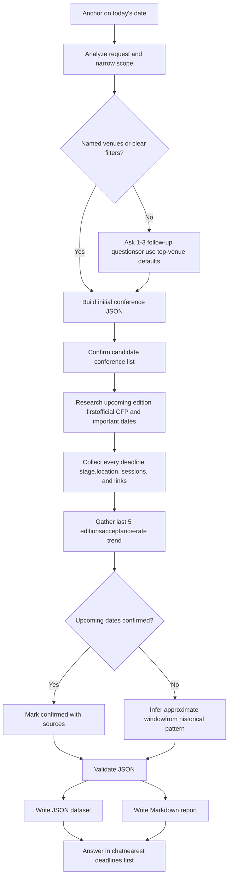

> 本页保存的是公开项目资料快照，阅读过程不需要连接 GitHub。

# ConferenceWatch

An **Agent Skill** that watches upcoming AI/ML conferences and reports, for each
one: **submission deadlines (every stage)**, dates, **location**, **special
sessions / call for papers**, official **web links**, and a **5-year
acceptance-rate trend**. It is written to be reusable across common coding
agents that can search the web — **Claude Code, Codex, and similar**.

---

## What it produces

Every run yields two artifacts:

1. **`conferences..json`** — the structured source of truth. One object
   per conference (keyed by acronym), each holding the upcoming edition
   (deadlines, location, special sessions, links) and a 5-year acceptance-rate
   trend. Schema: references/json-schema.md.
2. **`conference-report..md`** — a human-readable report with a short
   summary, a nearest-deadlines table, a per-conference breakdown, and a clearly
   separated "approximate / inferred" section. Template:
   assets/report.template.md.

The agent also answers **directly in chat** with the most time-sensitive items.

---

## How to use

This skill is plain Markdown + JSON, so it can be used by Codex, Claude Code,
or any agent that can read SKILL.md, search/fetch the web, and write
files.

### Install for Codex
Clone directly into Codex's personal skills directory:

```bash
git clone https://github.com/Zsun79/ConferenceWatch.git ~/.codex/skills/conference-watch
```

If you already cloned the project somewhere else, run this from the root of this
cloned skill repository to link the current checkout into Codex:

```bash
mkdir -p ~/.codex/skills
ln -s "$(pwd)" ~/.codex/skills/conference-watch
```

Then ask Codex naturally for AI/ML conference deadlines, venue comparisons, or
submission planning. Codex will use SKILL.md as the workflow when
the request matches the skill description.

### Install for Claude Code
Clone directly into Claude's personal skills directory:

```bash
git clone https://github.com/Zsun79/ConferenceWatch.git ~/.claude/skills/conference-watch
```

If you already cloned the project somewhere else, run this from the root of this
cloned skill repository to link the current checkout into Claude:

```bash
mkdir -p ~/.claude/skills
ln -s "$(pwd)" ~/.claude/skills/conference-watch
```

If this checkout is the project where you want Claude to load the skill, run
this from the repository root to link the current directory into
`.claude/skills/conference-watch`:

```bash
mkdir -p .claude/skills
ln -s "$(pwd)" .claude/skills/conference-watch
```

The skill activates from its `description` when your request matches.

### Use with other agents
For agents without a dedicated skill folder, use this repository as a local
instruction bundle:

- Point the agent at SKILL.md as the task instructions.
- Keep references/conference-catalog.md,
  references/json-schema.md, and the files in
  assets/ available as supporting context.
- Ask the agent to follow the workflow and write the JSON/report artifacts into
  your project folder.

**Requirement:** the host agent must have a **web search / fetch** capability
(and, to save files, filesystem access). No API keys or build step required.

### Example prompts

```
> What are the deadlines for the top NLP conferences in the next 6 months?
> Track NeurIPS, ICML, and ICLR 2026 for me.
> Compare the top-tier CV venues by acceptance rate and next deadline.
> List the top 5 AI conferences with deadlines before end of 2026.
> I work in computer vision -- track the A* venues and show acceptance-rate trends.
> Just give me the top conferences, I don't want to specify an area.
```

---

## How it works (workflow)

The full logic lives in SKILL.md. In short:



1. **Anchor on today's date** — all "future vs past" decisions are relative to
   the current date, not the model's training cutoff.
2. **Analyze the request & narrow scope** — the agent asks 1–3 follow-up
   questions to filter by **area** (NLP/CV/RL/…), **reputation/tier** (CORE
   A*/A/B), **difficulty** (acceptance rate), and **horizon**. If you decline,
   it defaults to the **top AI venues** (see
   references/conference-catalog.md).
3. **Build the initial JSON** — the candidate conference list is written out
   first, then confirmed with you before the long search phase.
4. **Research the upcoming edition first** — searches official CFP/"important
   dates" pages, records **every deadline stage**, location, special sessions,
   and links; marks them `confirmed` with sources.
5. **Historical anchor (last 5 editions)** — builds the acceptance-rate trend
   and, when a future edition isn't announced yet, **infers an approximate
   deadline window from the historical pattern** — always flagged as
   `approximate`.
6. **Output** — validates the JSON, writes the Markdown report with a short
   synthesized summary, and answers in chat.

**Core rule: never fabricate dates.** Anything not on an authoritative source is
either `null` (with a note) or clearly marked *approximate/inferred*.

---

## Repository layout

```
ConferenceWatch/
├── SKILL.md                          # main skill: workflow + rules (entry point)
├── README.md                         # this file
├── references/
│   ├── conference-catalog.md         # curated venues by area/tier + source sites
│   └── json-schema.md                # JSON schema + field rules
└── assets/
    ├── conference-data.template.json # starting JSON structure
    └── report.template.md            # Markdown report template
```

---

## Notes & limitations

- Deadlines and rankings change; the skill **confirms on official sites** and
  cites sources, but always re-check the CFP before submitting.
- Acceptance-rate numbers can differ by source (main track vs. all tracks);
  the skill records the source alongside each figure.
- Inferred future dates are estimates only — labeled *approximate* everywhere.
- ⚠️ Generated reports are marked **PRIVATE** classification by default; handle
  the output accordingly.
